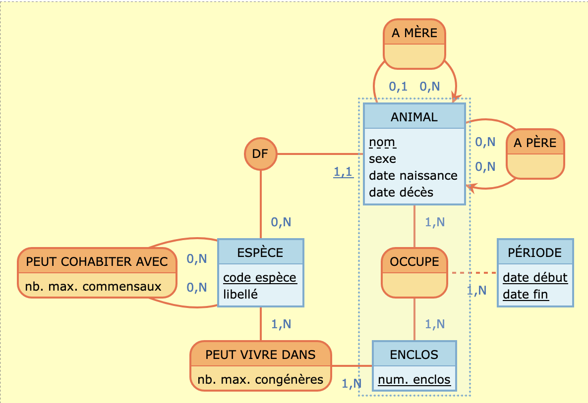

# Introduction {.label:s-intro}

## Présentation du projet

Les données financières des entreprises jouent un rôle crucial dans la compréhension de leur santé économique. Ce projet se concentre sur l'analyse des performances financières des entreprises françaises entre 2018 et 2022, en utilisant les données fournies par le Registre National du Commerce et des Sociétés (RNCS).


\bigskip

\begin{center}

\textbf{Comparer les performances des entreprises selon leur chiffre d'affaires et leur rentabilité.}
\medskip

\textbf{Étudier l’impact de la fiscalité sur la profitabilité des entreprises.}
\medskip

\textbf{Analyser l’évolution des ventes, des stocks et des taxes pour identifier des tendances économiques.}
\medskip
\end{center}

\medskip 

## Responsabilités et composition de l’équipe


\medskip

MOUTCHACHOU Lydia : Étudiant n°22212656

IBNMTAR Hazem : Étudiant n°22309227

BERETTI--PRENANT Esteban : Étudiant n°XXXX

VAROL Serdar : Étudiant n°22009668


\bigskip
## Objectifs et questions de recherche

Notre projet vise à analyser les performances financières des entreprises françaises entre 2018 et 2022. Pour ce faire, nous allons examiner plusieurs facteurs qui pourraient influencer la rentabilité des entreprises. Les questions spécifiques que nous allons aborder sont les suivantes :

### **Comparaison de la rentabilité par rapport au chiffre d'affaires :**

 a. Comment la rentabilité varie-t-elle en fonction de la taille de l'entreprise ?

 b. Y a-t-il une différence notable entre les entreprises qui ont recours au refinancement et celles qui n'en ont pas besoin ?
 
 
### **Comparaison de la rentabilité par rapport au chiffre** 

 a. La rentabilité des entreprises diffère-t-elle selon la ville où elles sont implantées ?

 b. Les entreprises qui exportent leurs produits ou services sont-elles plus rentables que celles qui opèrent uniquement sur le marché national ?
 
 
 
### **Impact fiscal et sectoriel :**

 a. Quel est l'impact des taxes sur la rentabilité des entreprises ?

 b. Comment la rentabilité varie-t-elle selon le secteur d'activité des entreprises ?


### **Évolution temporelle :**

 a. Comment la rentabilité des entreprises a-t-elle évolué entre 2012 et 2016 ?

 b. Peut-on identifier des tendances spécifiques ou des périodes de croissance/déclin dans les performances financières des entreprises ?


\medskip
En répondant à ces questions, nous espérons identifier les principaux facteurs influençant la rentabilité des entreprises françaises et fournir des insights précieux pour les décideurs économiques et les gestionnaires d'entreprises.


# Base de données

## Provenance des données


Les données utilisées dans ce projet proviennent du jeu de données Kaggle :
\medskip

 - **Profit and loss - Ontology.csv :** Contient les comptes de résultat de 100 000 entreprises françaises, avec des informations détaillées sur les revenus, les dépenses et les bénéfices.
 \medskip
- **APE_Fusion.csv :** Utilise le code APE pour classer les entreprises selon leur secteur d’activité, permettant des comparaisons sectorielles précises.
\medskip
- **Data_Kaggle.csv :** Fournit des données globales sur les entreprises, incluant les ventes, les stocks et les taxes, permettant d'analyser l’évolution des performances financières sur plusieurs années.

\medskip
**Lien vers les données :** Kaggle Dataset[https://www.kaggle.com/datasets/briaclg/financial-data-of-french-compagnies/data?select=Profit+and+loss+-+Onthology.csv]


## Descriptif des tables


| Nom colonne   | Type  | Signification                                          | Caractéristique |
|:-------------:|:-----:|:------------------------------------------------------:|:---------------:|
|Columns (FR/EN)|varchar|Colonnes des états\\financiers en français et en anglais|                |


Table: Profit and loss - Ontology.csv (nombre de lignes $\times$ nombre de colonnes)


## Modèles MCD et MOD

- Pour le MCD, inclure une image réalisée avec le logiciel Mocodo [https://www.mocodo.net/] telle que celle visible sur la Figure$~$\ref{uml} ci-dessous :

  {#uml width="8cm" height="4cm"}

- Pour le MOD, inclure une image réalisée avec le designer de phpmyadmin

\bigskip

Noter en passant qu'il est possible de créer des diagrammes en R Markdown au moyen du package `DiagrammeR` [\url{https://rich-iannone.github.io/DiagrammeR/graphviz_and_mermaid.html}] comme on peut le voir ci-dessous.


``` r
# install.packages("webshot",dependencies = TRUE)
# library(webshot)
# webshot::install_phantomjs()
Sys.setenv(OPENSSL_CONF="/dev/null")
DiagrammeR::grViz("
digraph boxes_and_circles {

  # a 'graph' statement
  graph [overlap = true, fontsize = 10]

  # several 'node' statements
  node [shape = box,
        fontname = Helvetica]
  A; B; C; D; E; F

  node [shape = circle,
        fixedsize = true,
        width = 0.9] // sets as circles
  1; 2; 3; 4; 5; 6; 7; 8

  # several 'edge' statements
  A->1 B->2 B->3 B->4 C->A
  1->D E->A 2->4 1->5 1->F
  E->6 4->6 5->7 6->7 3->8
}
")
```

```{=html}
<div class="grViz html-widget html-fill-item" id="htmlwidget-f655e119dc116e66e251" style="width:468px;height:10cm;"></div>
<script type="application/json" data-for="htmlwidget-f655e119dc116e66e251">{"x":{"diagram":"\ndigraph boxes_and_circles {\n\n  # a \"graph\" statement\n  graph [overlap = true, fontsize = 10]\n\n  # several \"node\" statements\n  node [shape = box,\n        fontname = Helvetica]\n  A; B; C; D; E; F\n\n  node [shape = circle,\n        fixedsize = true,\n        width = 0.9] // sets as circles\n  1; 2; 3; 4; 5; 6; 7; 8\n\n  # several \"edge\" statements\n  A->1 B->2 B->3 B->4 C->A\n  1->D E->A 2->4 1->5 1->F\n  E->6 4->6 5->7 6->7 3->8\n}\n","config":{"engine":"dot","options":null}},"evals":[],"jsHooks":[]}</script>
```


## Import des données 

- Préciser les nettoyages réalisés avant l'import comme l'uniformisation des valeurs des champs (_e.g._, Mr, M., Monsieur, ...) ou le remplissage des valeurs manquantes par une valeur moyenne ...

\begin{itemize}
    \item  Source de données 1 :
    \begin{itemize} 
     \item Suppression des colonnes XXX, car XXX
     \item  Suppression des doublons dans les colonnes XXX
    \item  Filtrage en fonction de la colonne XXx, nous n'avons conservé que.... 
\end{itemize}
\end{itemize}


## Requêtes réalisées


Pour chaque requête, l'exprimer en langage naturel puis en SQL. Puis donner le résultat obtenu (ou un extrait) et expliquer ce résultat.

L'objectif est de varier le type de requêtes et de répondre à votre problématique initiale.

## Quelques détails techniques


On peut interagir avec une base de données directement depuis RMarkdown. Un fichier .Rmd sera fourni pour donner des exemples.

# Matériel et Méthodes

## Logiciels

Lister tous les logiciels utilisé pour la partie statistique du rapport (et également ceux pour gérer et communiquer entre les membres du projet s'il y en a en particulier)

\medskip

R (ou Python) est le logiciel à privilégier pour la Science des Données. Pour assurer une reproductibilité maximale, vous devriez utiliser R Markdown (ou un Notebook Jupyter, et éventuellement un outil de gestion des versions tel que `Git`), par exemple via Google Colab ou RStudio dans les nuages. Évitez d'utiliser Word!

\bigskip

Il est de votre responsabilité de donner les versions des logiciels que vous utilisez, ainsi que de donner des informations techniques sur l'ordinateur qui vous a servi pour les analyses (système d'exploitation, vitesse du processeur, etc.). Penser à fournir des citations pour les logiciels utilisés, par exemple \footnote{L'entrée BibTeX ajoutée dans le fichier \texttt{references.bib} a été obtenue grâce à la commande  \texttt{citation(package = "tidyverse")} tapée dans la console de R.}.
 


## Modélisation statistique

Quels outils ou méthodes de statistiques allez-vous utiliser? Donner des équations mathématiques s'il y a lieu et lister les éventuels présupposés («assumptions» en anglais) que vous devez faire sur les données afin d'utiliser ces outils ou méthodes (_e.g._, normalité, absence de valeurs aberrantes, etc.).

Il est également bon d'indiquer quelles sont les avantages et les limites de ces méthodes.

Vous pourrez consulter avec profit les Chapitre 11--13 du livre sur R utilisé pendant le cours :

<http://biostatisticien.eu/springeR/livreR.pdf>

# Analyse Exploratoire des Données

Toute étude impliquant des données doit **obligatoirement** inclure une analyse exploratoire préalable. Celle-ci permet de mieux comprendre l'information contenue dans les données.

Il faut produire de nombreux résumés graphiques (_e.g._, histogrammes, nuages de points, boxplots, etc.) et numériques (_e.g._, médiane, moyenne, variance, etc.). Ainsi, il faut faire une analyse descriptive uni- et bivariée systématique de toutes les variables du jeu de données. Puis, il faut uniquement conserver les plus pertinents (les autres pouvant être gardés en Annexe), c'est-à-dire ceux qui permettront de dégager des éléments de réponse pour la question de recherche envisagée.  Chaque figure et tableau doit être commenté. Mais il ne faut pas extrapoler et dire des choses qui ne sont pas visibles dans ces graphiques ou tableaux. Pour chaque analyse, vous pourrez préciser le nombre d'individus/ d'unités statistiques concernés au total.

Vous pourrez consulter avec profit le Chapitre 9 du livre sur R utilisé pendant le cours :

<http://biostatisticien.eu/springeR/livreR.pdf>

## Utiliser R {.fragile}

Il est facile d'inclure des codes R dans votre rapport, qui seront exécutés à la volée (_i.e._, lors de la traduction de votre fichier `Rmd` en fichier `PDF` ou `DOC`). Par exemple:


``` r
boxplot(cars, col = c("#5975a4", "#cc8963"))
```

\begin{figure}

{\centering \includegraphics[width=7cm]{scdon2-UPV-report-template_sansPython_files/figure-latex/unnamed-chunk-2-1} 

}

\caption{\label{fig:boxplots}Deux boxplots.}\label{fig:unnamed-chunk-2}
\end{figure}

``` r
colMeans(cars)
```

```
## speed  dist 
## 15.40 42.98
```


Les lignes de code ne doivent pas dépasser dans la marge de droite. Ainsi on pourrait remplacer le chunk ci-dessous:


``` r
boxplot(cars, main = "Un titre qui est vraiment beaucoup trop long et qui dépasse dans la marge de droite")
```

\begin{figure}

{\centering \includegraphics[width=7cm]{scdon2-UPV-report-template_sansPython_files/figure-latex/unnamed-chunk-3-1} 

}

\caption{Pas super.}\label{fig:unnamed-chunk-3}
\end{figure}

par celui-ci:

\tiny


``` r
boxplot(cars, 
        main = "Un titre qui est vraiment beaucoup trop long\n mais qui ne dépasse plus dans la marge de droite")
```

\begin{figure}

{\centering \includegraphics[width=7cm]{scdon2-UPV-report-template_sansPython_files/figure-latex/unnamed-chunk-4-1} 

}

\caption{Déjà mieux.}\label{fig:unnamed-chunk-4}
\end{figure}

\normalsize

où l'on a:

- utilisé la commande \LaTeX\ `\tiny` pour changer la taille de la police (suivi de de `\normalsize` pour revenir à la taille normale), 
- mis l'instruction `main = ...` sur la deuxième ligne,
- utilisé `\n` pour afficher le titre sur deux lignes.


# Analyse et Résultats

Dans cette partie, vous pourrez utiliser les outils et méthodes vus au semestre précédent pour analyser les liens entre les variables.

Pour cela, vous pourrez utiliser les tests du $\chi^2$, test du coefficient de corrélation linéaire, test d'Anova, la droite de régression linéaire.

Vous pourrez également proposer des modèles pour faire du clustering (k-means, CAH), de la classification (K plus proches voisins par exemple) comme vu en Science des données 1.  

## La droite de régression linéaire : un premier exemple

Si on souhaite expliquer les variations d'une variables réponse $Y$ en fonction d'un certain nombre de prédicteurs $x_1,\ldots,x_p$, on peut utiliser un modèle de régression linéaire simple ($p=1$) ou multiple ($p>1$)

$$
Y_i = \beta_0 + \beta_1 x_{1i} + \cdots +\beta_p x_{pi} + \epsilon_i, \qquad i=1,\ldots,n.
$$
où l'on présuppose que les $\epsilon_i$ sont i.i.d.\ $N(0,1)$ pour tout $i=1,\ldots,n$ ($n$ étant la taille de l'échantillon).

Vous pourrez toujours consulter avec profit les Chapitre 11--13 du livre sur R utilisé pendant le cours :

<http://biostatisticien.eu/springeR/livreR.pdf>

Ces chapitres détaillent l'utilisation de certains tests et modèles sous `R`.

# Discussion

Placer les résultats que vous avez obtenus dans le chapitre précédent en perspective par rapport au problème étudié.

# Conclusion et perspectives {.label:ccl}

Quelles sont les conclusions principales? Quelles sont vos recommandations pour le commanditaire? Quelles analyses subséquentes pourraient être faites dans le futur?

\bigskip

On attend de vous deux types de perspectives : des perspectives à court terme pour améliorer rapidement votre approche et des perspectives à plus long terme qu'elles soient liées à la science des données ou au domaine métier pour lequel vous avez travaillé.

\bigskip

Lister également les difficultés rencontrées dans la partie BD (e.g., taille de la base, manque de données, ...) et dans la partie statistique.

# Bibliographie {-}

<div id="refs"></div>

\bibliographystyle{elsarticle-harv}
\bibliography{references}

# Annexes {-}


Il faut utiliser les annexes de façon judicieuse. C'est ici que l'on place des résultats trop volumineux pour apparaître dans le corps du rapport. Ou bien des résultats (e.g., graphiques) moins intéressants que les autres. Cela permet de limiter le nombre de pages du coeur du rapport, et d'ajouter des détails dans cette partie pour le lecteur désireux d'en savoir plus.

## **Codes** {-}

Ajouter vos codes informatique ici. Les codes doivent être correctement indentés et commentés.

## **Tables** {-}

Si vous avez des tableaux supplémentaires, vous pouvez les ajouter ici.

Utiliser https://www.tablesgenerator.com/markdown_tables pour créer des tables Markdown simples, ou bien utiliser \LaTeX.

| Les tables   |        sont       |  cool |
|--------------|:-----------------:|------:|
| col 1 est    |  alignée à gauche | $1600 |
| col 2 est    |     centrée       |   $12 |
| col 3 est    | alignée à droite  |    $1 |

Table: une légende au-dessus du tableau. \label{tab7.1}

Aligner les nombres de la troisième colonne sur la droite permet d'afficher les unités au-dessus des unités, les dizaines au-dessus des dizaines, etc. Il faut toujours privilégier cette présentation.

