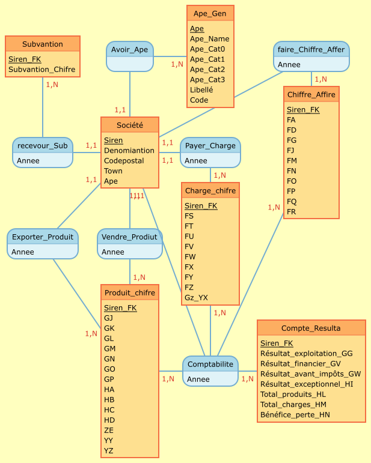
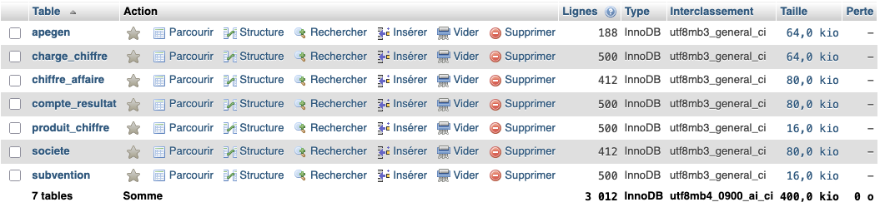
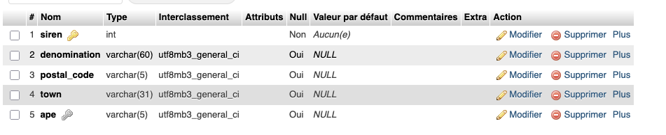
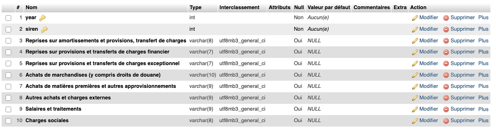
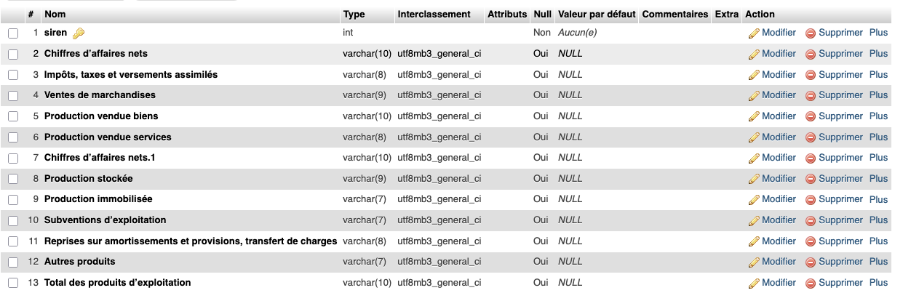
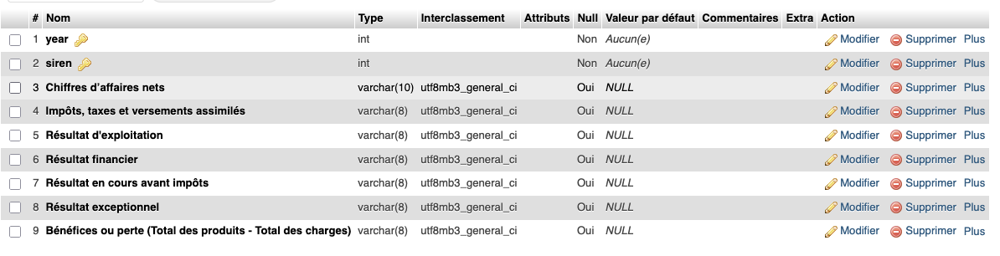
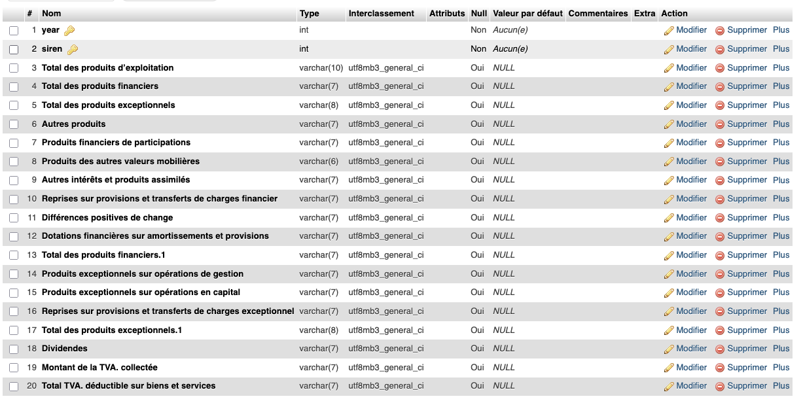
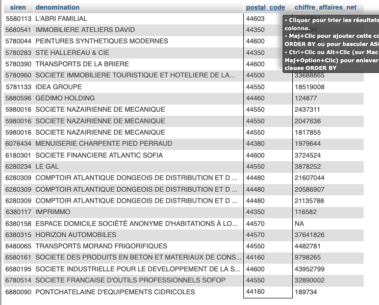
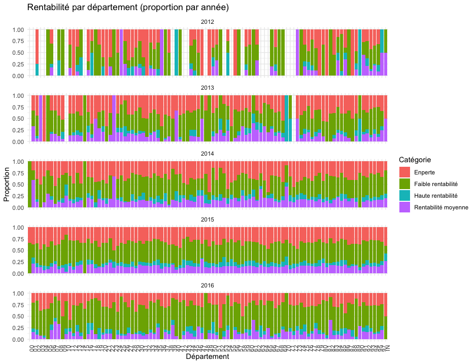

# Introduction {.label:s-intro}

## Présentation du projet

Les données financières des entreprises jouent un rôle crucial dans la compréhension de leur santé économique. Ce projet se concentre sur l'analyse des performances financières des entreprises françaises entre 2018 et 2022, en utilisant les données fournies par le Registre National du Commerce et des Sociétés (RNCS).


\bigskip

\begin{itemize}[label=$\circ$]
    \item \textbf{Comparer les performances des entreprises selon leur chiffre d'affaires et leur rentabilité.}
    \item \textbf{Étudier l’impact de la fiscalité sur la profitabilité des entreprises.}
    \item \textbf{Analyser l’évolution des ventes, des stocks et des taxes pour identifier des tendances économiques.}
\end{itemize}


\medskip 

## Responsabilités et composition de l’équipe


\medskip

MOUTCHACHOU Lydia : Étudiant n°22212656

IBNMTAR Hazem : Étudiant n°22309227

BERETTI--PRENANT Esteban : Étudiant n°22208752

VAROL Serdar : Étudiant n°22009668


\bigskip
## Objectifs et questions de recherche

Notre projet vise à analyser les performances financières des entreprises françaises entre 2018 et 2022. Pour ce faire, nous allons examiner plusieurs facteurs qui pourraient influencer la rentabilité des entreprises. Les questions spécifiques que nous allons aborder sont les suivantes :

### **Comparaison de la rentabilité par rapport au chiffre d'affaires(Lydia) :**

 a. Comment la rentabilité varie-t-elle en fonction de la taille de l'entreprise ?

 b. Y a-t-il une différence notable entre les entreprises qui ont recours au refinancement et celles qui n'en ont pas besoin ?
 
 
### **Comparaison de la rentabilité par rapport au chiffre** 

 a. La rentabilité des entreprises diffère-t-elle selon la ville où elles sont implantées ?

 b. Les entreprises qui exportent leurs produits ou services sont-elles plus rentables que celles qui opèrent uniquement sur le marché national ?
 
 
 
### **Impact fiscal et sectoriel :**

 a. Quel est l'impact des taxes sur la rentabilité des entreprises ?

 b. Comment la rentabilité varie-t-elle selon le secteur d'activité des entreprises ?


### **Évolution temporelle :**

 a. Comment la rentabilité des entreprises a-t-elle évolué entre 2012 et 2016 ?

 b. Peut-on identifier des tendances spécifiques ou des périodes de croissance/déclin dans les performances financières des entreprises ?


\medskip
En répondant à ces questions, nous espérons identifier les principaux facteurs influençant la rentabilité des entreprises françaises et fournir des insights précieux pour les décideurs économiques et les gestionnaires d'entreprises.


# Base de données

## Provenance des données


Les données utilisées dans ce projet proviennent du jeu de données Kaggle :
\medskip

\begin{itemize}[label=$\circ$]
  \item \textnormal{\textbf{Profit and loss \- Ontology.csv :} Contient les comptes de résultat de 100 000 entreprises françaises, avec des informations détaillées sur les revenus, les dépenses et les bénéfices.}
  
  \item \textnormal{\textbf{APE\_Fusion.csv :} Utilise le code APE pour classer les entreprises selon leur secteur d’activité, permettant des comparaisons sectorielles précises.}

  \item \textnormal{\textbf{Data\_Kaggle.csv :} Fournit des données globales sur les entreprises, incluant les ventes, les stocks et les taxes, permettant d'analyser l’évolution des performances financières sur plusieurs années.}
\end{itemize}

\medskip

\textit{Lien vers les données :} \href{https://www.kaggle.com/datasets/briaclg/financial-data-of-french-compagnies/data?select=Profit+and+loss+-+Onthology.csv}{Kaggle Dataset}


## Descriptif des tables
\bigskip

### Table 1: APE_Fusion.csv
\begin{table}[H]
\centering
\scriptsize
\begin{tabular}{|p{3.2cm}|p{1.2cm}|p{7.5cm}|p{2.5cm}|}
\hline
\textbf{Nom colonne} & \textbf{Type} & \textbf{Signification} & \textbf{Caractéristique} \\
\hline
Unname d: 0 & int & Index ou identifiant de ligne (peut être ignoré dans l'analyse) & \\
\hline
ape & object & Code APE complet de l'activité principale de l'entreprise & Clé primaire \\
\hline
ape\_name & object & Nom ou description de l'activité correspondant au code APE & \\
\hline
ape\_len & int & Longueur du code APE, indiquant le nombre de caractères qu'il contient & \\
\hline
ape\_cat0 & int & Premier niveau du code APE (division), composé des 2 premiers chiffres & \\
\hline
ape\_cat1 & float & Deuxième niveau du code APE (groupe), composé des 3 premiers chiffres & \\
\hline
ape\_cat2 & float & Troisième niveau du code APE (classe), composé des 4 premiers chiffres & \\
\hline
ape\_cat3 & object & Dernier niveau du code APE (sous-classe) & \\
\hline
Libellé & object & Description du secteur d'activité auquel appartient le code APE & \\
\hline
Code & object & Code alphabétique supplémentaire associé au secteur d'activité & \\
\hline
\end{tabular}
\footnotesize
\label{tab:ape_description}
\end{table}


### Table 2 : Profit and loss - Ontology.csv

\begin{table}[H]
\centering
\scriptsize
\begin{tabular}{|p{4cm}|p{2cm}|p{9cm}|}
\hline
\textbf{Nom colonne} & \textbf{Type} & \textbf{Signification} \\
\hline
Columns\_(FR/EN) & varchar & Colonnes des états financiers en français et en anglais \\
\hline
Description (FR) & varchar & Explication de ce que chaque colonne représente \\
\hline
Liasse (Id) & int & Identifiant unique des colonnes dans la base INPI \\
\hline
Calcul & varchar & Méthode de calcul pour certaines valeurs dans les colonnes \\
\hline
\end{tabular}
\normalsize
\end{table}


### Table 3 : Data_Kaggle.csv

\scriptsize
\begin{longtable}{|p{0.7cm}|p{12cm}|p{1.5cm}|}
\hline
\textbf{N\textdegree} & \textbf{Variable} & \textbf{Code} \\
\hline \endfirsthead
\hline \textbf{N\textdegree} & \textbf{Variable Nome} & \textbf{Nome de Colon} \\ \hline \endhead
1 & year & B \\
2 & Autres imp\^ots, taxes et versements assimil\'es & C \\
3 & Ventes de marchandises & D \\
4 & Production vendue biens & E \\
5 & Production vendue services & F \\
6 & Chiffres d\'affaires nets & G \\
7 & Production stock\'ee & H \\
8 & Production immobilis\'ee & I \\
9 & Subventions d\'exploitation & J \\
10 & Reprises sur amortissements et provisions, transfert de charges & K \\
11 & Autres produits & L \\
12 & Total des produits d\'exploitation & M \\
13 & Achats de marchandises (y compris droits de douane) & N \\
14 & Variation de stock (marchandises) & O \\
15 & Achats de mati\`eres premi\`eres et autres approvisionnements & P \\
16 & Variation de stock (mati\`eres premi\`eres et approvisionnements) & Q \\
17 & Autres achats et charges externes & R \\
18 & Imp\^ots, taxes et versements assimil\'es & S \\
19 & Salaires et traitements & T \\
20 & Charges sociales & U \\
21 & Autres charges & V \\
22 & Total des charges d\'exploitation & W \\
23 & R\'esultat d'exploitation & X \\
24 & B\'en\'efice attribu\'e ou perte transf\'er\'ee & Y \\
25 & Perte support\'ee ou b\'en\'efice transf\'er\'e & Z \\
26 & Produits financiers de participations & AA \\
27 & Produits des autres valeurs mobili\`eres et cr\'eances de l\'actif immobilis\'e & AB \\
28 & Autres int\'er\^ets et produits assimil\'es & AC \\
29 & Reprises sur provisions et transferts de charges financier & AD \\
30 & Diff\'erences positives de change & AE \\
31 & Produits nets sur cessions de valeurs mobili\`eres de placement & AF \\
32 & Total des produits financiers & AG \\
33 & Dotations financi\`eres sur amortissements et provisions & AH \\
34 & Int\'er\^ets et charges assimil\'ees & AI \\
35 & Diff\'erences n\'egatives de change & AJ \\
36 & Charges nettes sur cessions de valeurs mobili\`eres de placement & AK \\
37 & Total des charges financi\`eres & AL \\
38 & R\'esultat financier & AM \\
39 & R\'esultat en cours avant imp\^ots & AN \\
40 & Produits exceptionnels sur op\'erations de gestion & AO \\
41 & Produits exceptionnels sur op\'erations en capital & AP \\
42 & Reprises sur provisions et transferts de charges exceptionnel & AQ \\
43 & Total des produits exceptionnels & AR \\
44 & Charges exceptionnelles sur op\'erations de gestion & AS \\
45 & Charges exceptionnelles sur op\'erations en capital & AT \\
46 & Dotations exceptionnelles aux amortissements et provisions & AU \\
47 & Total des charges exceptionnelles & AV \\
48 & R\'esultat exceptionnel & AW \\
49 & Participation des salari\'es aux r\'esultats de l\'entreprise & AX \\
50 & Imp\^ots sur les b\'en\'efices & AY \\
51 & Total des produits & AZ \\
52 & Total des charges & BA \\
53 & B\'en\'efices ou perte (Total des produits - Total des charges) & BB \\
54 & Imp\^ots diff\'er\'es (compte de r\'esultat) & BC \\
55 & R\'esultat net des soci\'et\'es mises en \'equivalence & BD \\
56 & R\'esultat net des entreprises int\'egr\'ees & BE \\
57 & R\'esultat Groupe (R\'esultat net consolid\'e) & BF \\
58 & Part des int\'er\^ets minoritaires (R\'esultat hors groupe) & BG \\
59 & R\'esultat net part du groupe (part de la soci\'et\'e m\`ere) & BH \\
60 & R\'emun\'eration d\'interm\'ediaires et honoraires (hors r\'etrocessions) & BI \\
61 & Location, charges locatives et de copropri\'et\'e & BJ \\
62 & Effectif moyen du personnel & BK \\
63 & Sous-traitance & BL \\
64 & Personnel ext\'erieur \`a l\'entreprise & BM \\
65 & R\'etrocessions d\'honoraires, commissions et courtages & BN \\
66 & Taxe professionnelle & BO \\
67 & Montant de la TVA. collect\'ee & BP \\
\hline
\end{longtable}
\normalsize
\scriptsize
\begin{longtable}{|p{0.7cm}|p{12cm}|p{1.5cm}|}
\hline
\textbf{N\textdegree} & \textbf{Variable} & \textbf{Code} \\
\hline \endfirsthead
\hline \textbf{N\textdegree} & \textbf{Variable Nome} & \textbf{Nome de Colon} \\ \hline \endhead
68 & Total TVA. d\'eductible sur biens et services & BQ \\
69 & Dividendes & BR \\
70 & siren & BS \\
\hline
\end{longtable}
\normalsize

\newpage
## Modèles MCD et MOD

- Pour le MCD, inclure une image réalisée avec le logiciel Mocodo \href{https://www.mocodo.net/?mcd=eNqNksFu2zAMhu96Ch0dQAOW7Zab67ZK2zTL4ixtcjEUh14FOJKhyFm3N_J9b-AX62_HaOMEAwb4Ay1SIvlLjMvNQRmvrRnxWDsywe3DQPD43R296MwRCw9Wu7AgMRzy2Ka6rnxdieGUwyfJsKMZNUsBpmrX2kj5z50ddvZLZ7-Kid5QniNNZLfEMoXyTTWUC7OM3EWpLpggiq2j0BgixhyldLClQ8uC945wnPkQ0u1_D49auYJfk7E7fdwjeNNKYfde5WJhf8GBZtlM_SYXvSj380w_b7tq_Ena3lNX5KzT05u9DcE1kOAePIIp-AZm4DuYM3bzWljnyc2c3ZbaX9btAv3CSzJbR01Il_97pi-g12sMFuAHWIIn8AxWYC24_PNp9cxGDN9Z5pMsEiLlA5gAiJUQKyFWQuwYlzG-AhHApaxvBF8h-WrNIrsrvNroXHtqH79Z05z2Ze5VTxm_nA1xoVX866VO0_bEz-uqdfqEXovcavxhQgIpe7FMG2VSTS6Qy4H48Ktm6hK9K-q_fh_Ip7OEKRVNNkN5ML5DbGExcUlxbHkfjCcDcXSlbc_wPGLXVV2Zusp0SklBGI5gPB2wN-SeTJ4=}{https://www.moc\\odo.net} telle que celle visible sur la Figure$~$\ref{MCD} ci-dessous :
  
{#MOD width=8cm height=10cm }  

- Pour le MCD, inclure une image réalisée avec le logiciel MySQL, telle que celle visible sur la Figure~\ref{MCD} ci-dessous :

{#MCD width=15cm height=5cm}


{#Societe width=15cm height=5cm}


{#charge_chiffre width=15cm height=5cm}


Telle que celle visible sur la Figure~\ref{Chiffre_affaire} ci-dessous :

{#Chiffre_affaire width=15cm height=5cm}


{#compte_resulta width=15cm height=5cm}


{#produit_chiffre width=15cm height=5cm}


{#subvention width=15cm height=3cm}


\newpage

\bigskip
## Import des données 

\bigskip
Dans un premier temps, les données ont été chargées dans R à l'aide de la fonction $read\_csv()$. Ensuite, afin de faciliter l'importation de ces données dans phpMyAdmin, nous avons procédé à un **découpage (slicing)** de la base initiale en **sept tables distinctes**, chacune regroupant les variables pertinentes pour son thème spécifique.

\medskip

Par exemple, pour la table **"société"**, nous avons conservé uniquement les colonnes suivantes : *"siren", "denomination", "postal_code", "town" et "ape".*
Ce processus a été appliqué à chaque table en sélectionnant les attributs nécessaires, puis nous avons limité chaque sous-table à ses **300 premières lignes** afin de simplifier les tests d’importation.

\medskip

Enfin, les tables ont été exportées au format CSV à l’aide de la fonction write_csv. 

\medskip

Dans un premier temps, nous avions extrait les **300 premières lignes** de la base de données globale. Toutefois, afin d'obtenir un **échantillon plus équilibré et représentatif dans le temps**, nous avons modifié notre approche : nous avons sélectionné **les 100 premières lignes pour chaque année,** de 2012 à 2016.

\medskip

Pour cela, nous avons utilisé la bibliothèque **sqldf** dans R, qui permet d'exécuter des requêtes SQL directement sur des data frames. Par exemple, pour extraire les données de l’année 2012, nous avons utilisé la requête suivante :

\small

``` r
install.packages("sqldf")
library(sqldf)

result <- sqldf("SELECT * FROM data_kaggle WHERE year = 2012")
result
head(result)
annee_2012<-sqldf("SELECT* from data_kaggle WHERE year=2012")
annee_2013<-sqldf("SELECT* from data_kaggle WHERE year=2013")
annee_2014<-sqldf("SELECT* from data_kaggle WHERE year=2014")
annee_2015<-sqldf("SELECT* from data_kaggle WHERE year=2015")
annee_2016<-sqldf("SELECT* from data_kaggle WHERE year=2016")
cor(annee_2012$rentabilite,annee_2012$`Impôts, taxes et versements assimilés`,use = "complete.obs")
plot(annee_2012$rentabilite,annee_2012$`Impôts, taxes et versements assimilés`)
# Table 1 : Société
# Combinaison des 100 premières lignes de chaque sous-ensemble
sous_ensemble <- rbind(
  annee_2012[1:100, ],
  annee_2013[1:100, ],
  annee_2014[1:100, ],
  annee_2015[1:100, ],
  annee_2016[1:100, ]
)
View(sous_ensemble)
```
\normalsize

\medskip

   Cette commande retourne toutes les colonnes de la base data_kaggle pour les lignes dont l’année est **égale à 2012**.
Nous avons ensuite appliqué la même méthode pour chaque année (2013 à 2016), puis extrait **les 100 premières lignes** de chaque sous-ensemble. Enfin, nous avons combiné ces sous-ensembles afin d’obtenir une **table finale regroupant 500 lignes (100 par année)**. Cette nouvelle table est ainsi mieux structurée pour les futures analyses et pourra être **importée dans phpMyAdmin** pour les étapes suivantes de notre projet.

\newpage

\tiny

``` r
library(readr)
library(dplyr)

# Définir le chemin du fichier source
file_path <- ".....path"

# Charger le fichier CSV
full_data <- read_csv(file_path)

# Vérification des noms de colonnes disponibles
print(colnames(full_data))

# Table 1 : Société
societe <- full_data[1:300, c("siren", "denomination", "postal_code", "town", "ape")]
write_csv(societe, ".....path")

# Table 2 : Subventions
subvention <- full_data[1:300, c("siren", "Subventions d’exploitation")]
write_csv(subvention, ".....path")

# Table 3 : ApeGen
apegen <- full_data[1:300, c("ape", "ape_name", "ape_len", "ape_division", "ape_groupe", "ape_classe", "ape_sous_classe")]
write_csv(apegen, ".....path")

# Table 4 : Chiffre d'Affaires
chiffre_affaire <- full_data[1:300, c("siren", "Chiffres d’affaires nets", "Impôts, taxes et versements assimilés")]
write_csv(chiffre_affaire, ".....path")

# Table 5 : Charges Chiffre
charge_chiffre <- full_data[1:300, c(
  "siren", 
  "Reprises sur amortissements et provisions, transfert de charges", 
  "Reprises sur provisions et transferts de charges financier", 
  "Reprises sur provisions et transferts de charges exceptionnel", 
  "Achats de marchandises (y compris droits de douane)", 
  "Achats de matières premières et autres approvisionnements", 
  "Autres achats et charges externes", 
  "Salaires et traitements", 
  "Charges sociales"
)]
write_csv(charge_chiffre, ".....path")

# Table 6 : Produits Chiffre
produit_chiffre <- full_data[1:300, c(
  "siren", 
  "Total des produits d’exploitation", 
  "Total des produits financiers", 
  "Total des produits exceptionnels", 
  "Autres produits"
)]
write_csv(produit_chiffre, ".....path")

# Table 7 : Compte de Résultat
compte_resulta <- full_data[1:300, c(
  "siren", 
  "Chiffres d’affaires nets", 
  "Impôts, taxes et versements assimilés", 
  "Résultat d'exploitation", 
  "Résultat financier", 
  "Résultat en cours avant impôts", 
  "Résultat exceptionnel", 
  "Bénéfices ou perte (Total des produits - Total des charges)"
)]
write_csv(compte_resulta, ".....path")

# Vérifier le répertoire de travail actuel
getwd()
```
\normalsize

\newpage

## Requêtes réalisées


Pour chaque requête, l'exprimer en langage naturel puis en SQL. Puis donner le résultat obtenu (ou un extrait) et expliquer ce résultat.

L'objectif est de varier le type de requêtes et de répondre à votre problématique initiale.


1) Pour comperer et trouver selon leur code postal 


``` sql

SELECT 
    LEFT(postal_code, 2) AS departement,
    COUNT(*) AS nombre_entreprises
FROM 
    societe
WHERE 
    postal_code IS NOT NULL
GROUP BY 
    departement
ORDER BY 
    nombre_entreprises DESC;

```


{#MCD width=5cm height=10cm}

\newpage


``` sql
SELECT 
    s.siren,
    s.denomination,
    s.postal_code,
    cr.`Chiffres d’affaires nets` AS chiffre_affaires_net
FROM 
    societe s
JOIN 
    compte_resultat cr ON s.siren = cr.siren
WHERE 
    LEFT(s.postal_code, 2) = '44';

```

{#MCD width=10cm height=10cm}


## Quelques détails techniques


# Matériel et Méthodes

## Logiciels

Lister tous les logiciels utilisé pour la partie statistique du rapport (et également ceux pour gérer et communiquer entre les membres du projet s'il y en a en particulier)

\medskip

R (ou Python) est le logiciel à privilégier pour la Science des Données. Pour assurer une reproductibilité maximale, vous devriez utiliser R Markdown (ou un Notebook Jupyter, et éventuellement un outil de gestion des versions tel que `Git`), par exemple via Google Colab ou RStudio dans les nuages. Évitez d'utiliser Word!

\bigskip

Il est de votre responsabilité de donner les versions des logiciels que vous utilisez, ainsi que de donner des informations techniques sur l'ordinateur qui vous a servi pour les analyses (système d'exploitation, vitesse du processeur, etc.). Penser à fournir des citations pour les logiciels utilisés, par exemple \footnote{L'entrée BibTeX ajoutée dans le fichier \texttt{references.bib} a été obtenue grâce à la commande  \texttt{citation(package = "tidyverse")} tapée dans la console de R.}.
 


## Modélisation statistique

Quels outils ou méthodes de statistiques allez-vous utiliser? Donner des équations mathématiques s'il y a lieu et lister les éventuels présupposés («assumptions» en anglais) que vous devez faire sur les données afin d'utiliser ces outils ou méthodes (_e.g._, normalité, absence de valeurs aberrantes, etc.).

Il est également bon d'indiquer quelles sont les avantages et les limites de ces méthodes.

Vous pourrez consulter avec profit les Chapitre 11--13 du livre sur R utilisé pendant le cours :

<http://biostatisticien.eu/springeR/livreR.pdf>

# Analyse Exploratoire des Données

Toute étude impliquant des données doit **obligatoirement** inclure une analyse exploratoire préalable. Celle-ci permet de mieux comprendre l'information contenue dans les données.

Il faut produire de nombreux résumés graphiques (_e.g._, histogrammes, nuages de points, boxplots, etc.) et numériques (_e.g._, médiane, moyenne, variance, etc.). Ainsi, il faut faire une analyse descriptive uni- et bivariée systématique de toutes les variables du jeu de données. Puis, il faut uniquement conserver les plus pertinents (les autres pouvant être gardés en Annexe), c'est-à-dire ceux qui permettront de dégager des éléments de réponse pour la question de recherche envisagée.  Chaque figure et tableau doit être commenté. Mais il ne faut pas extrapoler et dire des choses qui ne sont pas visibles dans ces graphiques ou tableaux. Pour chaque analyse, vous pourrez préciser le nombre d'individus/ d'unités statistiques concernés au total.

Vous pourrez consulter avec profit le Chapitre 9 du livre sur R utilisé pendant le cours :

<http://biostatisticien.eu/springeR/livreR.pdf>


# Analyse et Résultats

## **Comparer les catégories d'entreprises en fonction des Chiffres d’affaires nets**
\bigskip
**Variables :** Chiffres d’affaires nets + catégories (Effectif moyen du personnel)

### Étapes pour créer une visualisation :
contuinee ;;;;;;;

#### Les catégories d’entreprises :
\bigskip
\scriptsize
\begin{quote}
\textit{L’article 51 de la loi n°2008-776 du 4 août 2008 de modernisation de l’économie (\textbf{LME}) détermine, pour les besoins de l’analyse statistique, un classement des entreprises en quatre catégories : les microentreprises, les petites et moyennes entreprises (\textbf{PME}), les entreprises de taille intermédiaire (\textbf{ETI}) et les grandes entreprises.\\ \\Le décret n° 2008-1354 du 18 décembre 2008 précise les critères permettant de déterminer l’appartenance à une catégorie d'entreprises.}
\end{quote}
\normalsize

\begin{itemize}[label=$\circ$]
  \item \textnormal{ \textbf{La microentreprise} est une entreprise dont l'effectif est inférieur à 10 personnes et dont le chiffre d'affaires ou le total du bilan annuel n'excède pas 2 millions d'euros}
\item \textnormal{ \textbf{la PME} est une entreprise dont l’effectif est inférieur à 250 personnes
et dont le chiffre d’affaires annuel n'excède pas 50 millions d'euros ou
dont le total de bilan n'excède pas 43 millions d'euros }
\item \textnormal{\textbf{L'ETI}, entreprise de taille intermédiaire, est une entreprise qui n'appartient pas à la catégorie des PME, dont l’effectif est inférieur à 5000 personnes et dont le chiffre d'affaires annuel n'excède pas 1 500 millions d'euros ou dont le total de bilan n'excède pas 2 000 millions d'euros}
\item \textnormal{\textbf{La grande entreprise} est une entreprise qui ne peut pas être classée
dans les catégories précédentes}
\end{itemize}
\newpage
#### Visualisation : Boxplot ou Diagramme en barres

``` r
boxplot(cars, col = c("#5975a4", "#cc8963"))
```

\begin{figure}

{\centering \includegraphics[width=7cm]{scdon2-UPV-report-template_sansPython_files/figure-latex/unnamed-chunk-5-1} 

}

\caption{\label{fig:boxplots}Deux boxplots.}\label{fig:unnamed-chunk-5}
\end{figure}

``` r
colMeans(cars)
```

```
## speed  dist 
## 15.40 42.98
```

``` r
 #ecrire code R // notre code pour tous calcul or graph etc etc. 
```

#### Test Statistique : ANOVA  (Analyse de la Variance) ou les autre

**Chauque un/e doit proposer son text :) **

Dans cette partie, vous pourrez utiliser les outils et méthodes vus au semestre précédent pour analyser les liens entre les variables.

Pour cela, vous pourrez utiliser les tests du $\chi^2$, test du coefficient de corrélation linéaire, test d'Anova, la droite de régression linéaire.

Vous pourrez également proposer des modèles pour faire du clustering (k-means, CAH), de la classification (K plus proches voisins par exemple) comme vu en Science des données 1.  


\newpage
## **Analyser s'il y a une différence entre les entreprises qui ont recours au refinancement et celles qui n'en ont pas besoin**
\bigskip
**Variables :**  indicateur de refinancement + chiffre d'affaires nets

### Étapes pour créer une visualisation :
contuinee ;;;;;;;

#### Les catégories d’entreprises :
\bigskip
Créez deux groupes :
 Entreprises avec refinancement : Total des charges financières = 0
 Entreprises sans refinancement : Total des charges financières = 0

#### Visualisation : Boxplot ou Diagramme en barres

``` r
boxplot(cars, col = c("#5975a4", "#cc8963"))
```

\begin{figure}

{\centering \includegraphics[width=7cm]{scdon2-UPV-report-template_sansPython_files/figure-latex/unnamed-chunk-6-1} 

}

\caption{\label{fig:boxplots}Deux boxplots.}\label{fig:unnamed-chunk-6}
\end{figure}

``` r
colMeans(cars)
```

```
## speed  dist 
## 15.40 42.98
```

``` r
 #ecrire code R // notre code pour tous calcul or graph etc etc. 
```

#### Test Statistique : ANOVA  (Analyse de la Variance) ou les autre

**Chauque un/e doit proposer son text :) **s
S
Dans cette partie, vous pourrez utiliser les outils et méthodes vus au semestre précédent pour analyser les liens entre les variables.

Pour cela, vous pourrez utiliser les tests du $\chi^2$, test du coefficient de corrélation linéaire, test d'Anova, la droite de régression linéaire.

Vous pourrez également proposer des modèles pour faire du clustering (k-means, CAH), de la classification (K plus proches voisins par exemple) comme vu en Science des données 1.  
s
\newpage


## **Analyser la rentabilité des entreprises en fonction de leur localisation géographique** Serdar VAROL
\bigskip

L’objectif de cette étude est d’analyser la rentabilité des entreprises en France à partir de données financières entre 2012 et 2016. La rentabilité a été calculée à partir du *résultat d’exploitation*, du *résultat financier* et du *chiffre d’affaires net* des entreprises et a été examinée par **année** et par **département**.

\medskip

### Préparation des données

\medskip

1) Un fichier CSV contenant les données financières de l’entreprise de 2012 à 2016 a été utilisé 

\small

\normalsize

2) **Variables :**

\medskip

\begin{itemize}[label=$\circ$]
    \item \textnormal{Year}
    \item \textnormal{Siren}
    \item \textnormal{résultat d'exploitation}
    \item \textnormal{chiffres d’affaires nets}
    \item \textnormal{résultat financier}
    \item \textnormal{code\_postal}
\end{itemize}


  

$$
      \text{rentabilité} = \frac{\text{résultat d'exploitation} + \text{résultat financier}}{\text{chiffres d’affaires nets}}
$$
\medskip

3) Création d'une variable catégorielle : La valeur de rentabilité est divisée dans les classes suivantes :

\begin{itemize}[label=$\circ$]
    \item \textnormal{Rentabilité $< 0$ : \og En perte\fg}
    \item \textnormal{$0 \leq$ Rentabilité $< 0{,}1$ : \og Faible rentabilité\fg}
    \item \textnormal{$0{,}1 \leq$ Rentabilité $< 0{,}3$ : \og Rentabilité moyenne\fg}
    \item \textnormal{Rentabilité $\geq 0{,}3$ : \og Haute rentabilité\fg}
\end{itemize}

\newpage

**Formuler les hypothèses :**

\bigskip

- **Hypothèse nulle (H\textsubscript{0})** : La répartition des catégories de rentabilité (rentabilité) par département ne diffère pas.
- **Hypothèse alternative (H\textsubscript{1})** : La distribution des catégories de rentabilité varie selon le département.


\bigskip

\scriptsize
\begin{longtable}{|p{1.2cm}|p{3.5cm}|p{2cm}|p{3cm}|p{4.2cm}|}
\hline
\textbf{Année} & \textbf{Type de test} & \textbf{Valeur p} & \textbf{Décision ($\alpha = 0{,}05$)} & \textbf{Remarque} \\
\hline \endfirsthead
\hline \textbf{Année} & \textbf{Type de test} & \textbf{Valeur p} & \textbf{Décision ($\alpha = 0{,}05$)} & \textbf{Remarque} \\ \hline \endhead
2012 & Chi² (simulé) & 0.2474 & H\textsubscript{0} non rejetée & Échantillon insuffisant ou déséquilibré \\
2013 & Chi² (simulé) & 0.0019 & H\textsubscript{0} rejetée & Différence significative entre départements \\
2014 & Chi² (simulé) & 9.999e-05 & H\textsubscript{0} rejetée & Différence significative entre départements \\
2015 & Chi² (simulé) & 9.999e-05 & H\textsubscript{0} rejetée & Forte différence observée \\
2016 & Chi² (simulé) & 9.999e-05 & H\textsubscript{0} rejetée & Différence significative entre départements \\
\hline
\multicolumn{5}{l}{\textit{Note : L’année 2012 présente un faible nombre d’observations et des distributions déséquilibrées.}}
\end{longtable}


\bigskip


\scriptsize
\begin{longtable}{|p{1.2cm}|p{3cm}|p{3.5cm}|p{6cm}|}
\hline
\textbf{Année} & \textbf{Valeur p} & \textbf{Décision} & \textbf{Interprétation} \\
\hline \endfirsthead
\hline \textbf{Année} & \textbf{Valeur p} & \textbf{Décision} & \textbf{Interprétation} \\ \hline \endhead
2012 & 1 & Pas de différence significative & Faible volume de données \\
2013 & \textless{} 0.001 & Différence significative & Rentabilité varie selon les départements \\
2014 & 1 & Pas de différence significative & Rentabilité homogène \\
2015 & 1 & Pas de différence significative & Rentabilité homogène \\
2016 & 1 & Pas de différence significative & Rentabilité homogène \\
\hline
\multicolumn{4}{l}{\textit{Conclusion : Seule l’année 2013 présente une variation significative de la rentabilité selon les départements.}}
\end{longtable}

\newpage


\section*{Représentation cartographique}


- Pour le MOD, inclure une image réalisée avec le logiciel MySQl
\newline telle que celle visible sur la Figure$~$\ref{box_plot} ci-dessous :
  
{#box_plot width=15cm height=10cm }  


\newpage

## **La variation de la rentabilité selon le secteur d'activité des entreprises**
\bigskip
**Variables** :  le code APE (le secteur d'activité des entreprises) + Chiffres d’affaires nets

### Étapes pour créer une visualisation :

#### Catégorisation des entreprises par secteur d'activité :

#### Visualisation :

**Boxplot** : Visualiser la distribution des chiffres d'affaires nets pour chaque secteur d'activité.\\
**Diagramme en barres** : Montrer la moyenne des chiffres d'affaires nets par secteur d'activité.

#### Test Statistique (ANOVA) :
**Chauque un/e doit proposer son text :) **

Dans cette partie, vous pourrez utiliser les outils et méthodes vus au semestre précédent pour analyser les liens entre les variables.

Pour cela, vous pourrez utiliser les tests du $\chi^2$, test du coefficient de corrélation linéaire, test d'Anova, la droite de régression linéaire.

Vous pourrez également proposer des modèles pour faire du clustering (k-means, CAH), de la classification (K plus proches voisins par exemple) comme vu en Science des données 1.  


\newpage

## **Analyser l'évolution de la rentabilité des entreprises entre 2012 et 2016**
\bigskip
**Variables** : Rentabilité + Année

### Étapes pour créer une visualisation :

#### Préparation des données :

Calcul de la rentabilité : Calculer le ratio de rentabilité pour chaque
entreprise et chaque année :

$$
\text{Rentabilité} = \frac{\text{Résultat net}}{\text{Chiffre d'affaires net}}
$$
Structure des données :
Organiser les données dans un tableau avec les colonnes suivantes :
Année, Rentabilité.

#### Visualisation :

**Boxplot** : Visualiser la distribution des chiffres d'affaires nets pour chaque secteur d'activité.\\
**Diagramme en barres** : Montrer la moyenne des chiffres d'affaires nets par secteur d'activité.

#### Test Statistique (ANOVA) :
**Chauque un/e doit proposer son text :) **

Dans cette partie, vous pourrez utiliser les outils et méthodes vus au semestre précédent pour analyser les liens entre les variables.

Pour cela, vous pourrez utiliser les tests du $\chi^2$, test du coefficient de corrélation linéaire, test d'Anova, la droite de régression linéaire.

Vous pourrez également proposer des modèles pour faire du clustering (k-means, CAH), de la classification (K plus proches voisins par exemple) comme vu en Science des données 1.  


## **Analyser l'impact des taxes sur la rentabilité des entreprises**
\bigskip
**Variables** :Rentabilité Ratio du résultat net sur le chiffre d'affaires net +Taxes (Montant total des taxes payées parles entreprises
\\Axes : Taxes (X) et Rentabilité (Y).

### Étapes pour créer une visualisation :

#### visualistion

Graphique de dispersion : tracer un graphique de dispersion pour visualiser
la relation entre la rentabilité et les taxes.


#### Test de corrélation :
**Chauque un/e doit proposer son text :) **

Dans cette partie, vous pourrez utiliser les outils et méthodes vus au semestre précédent pour analyser les liens entre les variables.

Pour cela, vous pourrez utiliser les tests du $\chi^2$, test du coefficient de corrélation linéaire, test d'Anova, la droite de régression linéaire.

Vous pourrez également proposer des modèles pour faire du clustering (k-means, CAH), de la classification (K plus proches voisins par exemple) comme vu en Science des données 1.  


## La droite de régression linéaire : un premier exemple

Si on souhaite expliquer les variations d'une variables réponse $Y$ en fonction d'un certain nombre de prédicteurs $x_1,\ldots,x_p$, on peut utiliser un modèle de régression linéaire simple ($p=1$) ou multiple ($p>1$)


$$
Y_i = \beta_0 + \beta_1 x_{1i} + \cdots +\beta_p x_{pi} + \epsilon_i, \qquad i=1,\ldots,n.
$$

où l'on présuppose que les $\epsilon_i$ sont i.i.d.\ $N(0,1)$ pour tout $i=1,\ldots,n$ ($n$ étant la taille de l'échantillon).

Vous pourrez toujours consulter avec profit les Chapitre 11--13 du livre sur R utilisé pendant le cours :

<http://biostatisticien.eu/springeR/livreR.pdf>

Ces chapitres détaillent l'utilisation de certains tests et modèles sous `R`.

# Discussion

Placer les résultats que vous avez obtenus dans le chapitre précédent en perspective par rapport au problème étudié.

# Conclusion et perspectives {.label:ccl}

Quelles sont les conclusions principales? Quelles sont vos recommandations pour le commanditaire? Quelles analyses subséquentes pourraient être faites dans le futur?

\bigskip

On attend de vous deux types de perspectives : des perspectives à court terme pour améliorer rapidement votre approche et des perspectives à plus long terme qu'elles soient liées à la science des données ou au domaine métier pour lequel vous avez travaillé.

\bigskip

Lister également les difficultés rencontrées dans la partie BD (e.g., taille de la base, manque de données, ...) et dans la partie statistique.

# Bibliographie {-}

<div id="refs"></div>

\bibliographystyle{elsarticle-harv}
\bibliography{references}

# Annexes {-}


Il faut utiliser les annexes de façon judicieuse. C'est ici que l'on place des résultats trop volumineux pour apparaître dans le corps du rapport. Ou bien des résultats (e.g., graphiques) moins intéressants que les autres. Cela permet de limiter le nombre de pages du coeur du rapport, et d'ajouter des détails dans cette partie pour le lecteur désireux d'en savoir plus.

## **Codes** {-}

Ajouter vos codes informatique ici. Les codes doivent être correctement indentés et commentés.

## **Tables** {-}

Si vous avez des tableaux supplémentaires, vous pouvez les ajouter ici.

Utiliser https://www.tablesgenerator.com/markdown_tables pour créer des tables Markdown simples, ou bien utiliser \LaTeX.

| Les tables   |        sont       |  cool |
|--------------|:-----------------:|------:|
| col 1 est    |  alignée à gauche | $1600 |
| col 2 est    |     centrée       |   $12 |
| col 3 est    | alignée à droite  |    $1 |

Table: une légende au-dessus du tableau. \label{tab7.1}

Aligner les nombres de la troisième colonne sur la droite permet d'afficher les unités au-dessus des unités, les dizaines au-dessus des dizaines, etc. Il faut toujours privilégier cette présentation.

