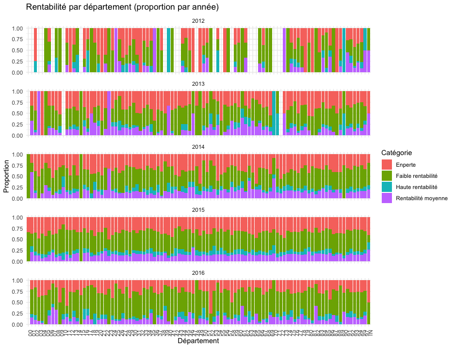

```{r setup, include=FALSE}
knitr::opts_chunk$set(echo = TRUE)
library(knitr)
library(kableExtra)

```


# Introduction {.label:s-intro}

## Présentation du projet

Les données financières des entreprises jouent un rôle crucial dans la compréhension de leur santé économique. Ce projet se concentre sur l'analyse des performances financières des entreprises françaises entre 2018 et 2022, en utilisant les données fournies par le Registre National du Commerce et des Sociétés (RNCS).


\bigskip

\begin{itemize}[label=$\circ$]
    \item \textbf{Comparer les performances des entreprises selon leur chiffre d'affaires et leur rentabilité.}
    \item \textbf{Étudier l’impact de la fiscalité sur la profitabilité des entreprises.}
    \item \textbf{Analyser l’évolution des ventes, des stocks et des taxes pour identifier des tendances économiques.}
\end{itemize}


\medskip 

## Responsabilités et composition de l’équipe


\medskip

MOUTCHACHOU Lydia : Étudiant n°22212656

IBNMTAR Hazem : Étudiant n°22309227

BERETTI--PRENANT Esteban : Étudiant n°22208752

VAROL Serdar : Étudiant n°22009668


\bigskip
## Objectifs et questions de recherche

Notre projet vise à analyser les performances financières des entreprises françaises entre 2018 et 2022. Pour ce faire, nous allons examiner plusieurs facteurs qui pourraient influencer la rentabilité des entreprises. Les questions spécifiques que nous allons aborder sont les suivantes :

\medskip

 **Comparaison de la rentabilité par rapport au chiffre d'affaires :**

 a. Comment la rentabilité varie-t-elle en fonction de la taille de l'entreprise ?

 b. Y a-t-il une différence notable entre les entreprises qui ont recours au refinancement et celles qui n'en ont pas besoin ?
 
 
 **Comparaison de la rentabilité par rapport au chiffre** 

 a. La rentabilité des entreprises diffère-t-elle selon la ville où elles sont implantées ?

 b. Les entreprises qui exportent leurs produits ou services sont-elles plus rentables que celles qui opèrent uniquement sur le marché national ?
 
 
 
  **Impact fiscal et sectoriel :**

 a. Quel est l'impact des taxes sur la rentabilité des entreprises ?

 b. Comment la rentabilité varie-t-elle selon le secteur d'activité des entreprises ?


 **Évolution temporelle :**

 a. Comment la rentabilité des entreprises a-t-elle évolué entre 2012 et 2016 ?

 b. Peut-on identifier des tendances spécifiques ou des périodes de croissance/déclin dans les performances financières des entreprises ?


\medskip
En répondant à ces questions, nous espérons identifier les principaux facteurs influençant la rentabilité des entreprises françaises et fournir des insights précieux pour les décideurs économiques et les gestionnaires d'entreprises.


# Base de données

## Provenance des données


Les données utilisées dans ce projet proviennent du jeu de données Kaggle :
\medskip

\begin{itemize}[label=$\circ$]
  \item \textnormal{\textbf{Profit and loss \- Ontology.csv :} Contient les comptes de résultat de 100 000 entreprises françaises, avec des informations détaillées sur les revenus, les dépenses et les bénéfices.}
  
  \item \textnormal{\textbf{APE\_Fusion.csv :} Utilise le code APE pour classer les entreprises selon leur secteur d’activité, permettant des comparaisons sectorielles précises.}

  \item \textnormal{\textbf{Data\_Kaggle.csv :} Fournit des données globales sur les entreprises, incluant les ventes, les stocks et les taxes, permettant d'analyser l’évolution des performances financières sur plusieurs années.}
\end{itemize}

\medskip

\textit{Lien vers les données :} \href{https://www.kaggle.com/datasets/briaclg/financial-data-of-french-compagnies/data?select=Profit+and+loss+-+Onthology.csv}{Kaggle Dataset}


## Descriptif des tables
\bigskip

### Table 1: APE_Fusion.csv
\begin{table}[H]
\centering
\scriptsize
\begin{tabular}{|p{3.2cm}|p{1.2cm}|p{7.5cm}|p{2.5cm}|}
\hline
\textbf{Nom colonne} & \textbf{Type} & \textbf{Signification} & \textbf{Caractéristique} \\
\hline
Unname d: 0 & int & Index ou identifiant de ligne (peut être ignoré dans l'analyse) & \\
\hline
ape & object & Code APE complet de l'activité principale de l'entreprise & Clé primaire \\
\hline
ape\_name & object & Nom ou description de l'activité correspondant au code APE & \\
\hline
ape\_len & int & Longueur du code APE, indiquant le nombre de caractères qu'il contient & \\
\hline
ape\_cat0 & int & Premier niveau du code APE (division), composé des 2 premiers chiffres & \\
\hline
ape\_cat1 & float & Deuxième niveau du code APE (groupe), composé des 3 premiers chiffres & \\
\hline
ape\_cat2 & float & Troisième niveau du code APE (classe), composé des 4 premiers chiffres & \\
\hline
ape\_cat3 & object & Dernier niveau du code APE (sous-classe) & \\
\hline
Libellé & object & Description du secteur d'activité auquel appartient le code APE & \\
\hline
Code & object & Code alphabétique supplémentaire associé au secteur d'activité & \\
\hline
\end{tabular}
\footnotesize
\label{tab:ape_description}
\end{table}


### Table 2 : Profit and loss - Ontology.csv

\begin{table}[H]
\centering
\scriptsize
\begin{tabular}{|p{4cm}|p{2cm}|p{9cm}|}
\hline
\textbf{Nom colonne} & \textbf{Type} & \textbf{Signification} \\
\hline
Columns\_(FR/EN) & varchar & Colonnes des états financiers en français et en anglais \\
\hline
Description (FR) & varchar & Explication de ce que chaque colonne représente \\
\hline
Liasse (Id) & int & Identifiant unique des colonnes dans la base INPI \\
\hline
Calcul & varchar & Méthode de calcul pour certaines valeurs dans les colonnes \\
\hline
\end{tabular}
\normalsize
\end{table}


### Table 3 : Data_Kaggle.csv

\scriptsize
\begin{longtable}{|p{0.7cm}|p{12cm}|p{1.5cm}|}
\hline
\textbf{N\textdegree} & \textbf{Variable} & \textbf{Code} \\
\hline \endfirsthead
\hline \textbf{N\textdegree} & \textbf{Variable Nome} & \textbf{Nome de Colon} \\ \hline \endhead
1 & year & B \\
2 & Autres imp\^ots, taxes et versements assimil\'es & C \\
3 & Ventes de marchandises & D \\
4 & Production vendue biens & E \\
5 & Production vendue services & F \\
6 & Chiffres d\'affaires nets & G \\
7 & Production stock\'ee & H \\
8 & Production immobilis\'ee & I \\
9 & Subventions d\'exploitation & J \\
10 & Reprises sur amortissements et provisions, transfert de charges & K \\
11 & Autres produits & L \\
12 & Total des produits d\'exploitation & M \\
13 & Achats de marchandises (y compris droits de douane) & N \\
14 & Variation de stock (marchandises) & O \\
15 & Achats de mati\`eres premi\`eres et autres approvisionnements & P \\
16 & Variation de stock (mati\`eres premi\`eres et approvisionnements) & Q \\
17 & Autres achats et charges externes & R \\
18 & Imp\^ots, taxes et versements assimil\'es & S \\
19 & Salaires et traitements & T \\
20 & Charges sociales & U \\
21 & Autres charges & V \\
22 & Total des charges d\'exploitation & W \\
23 & R\'esultat d'exploitation & X \\
24 & B\'en\'efice attribu\'e ou perte transf\'er\'ee & Y \\
25 & Perte support\'ee ou b\'en\'efice transf\'er\'e & Z \\
26 & Produits financiers de participations & AA \\
27 & Produits des autres valeurs mobili\`eres et cr\'eances de l\'actif immobilis\'e & AB \\
28 & Autres int\'er\^ets et produits assimil\'es & AC \\
29 & Reprises sur provisions et transferts de charges financier & AD \\
30 & Diff\'erences positives de change & AE \\
31 & Produits nets sur cessions de valeurs mobili\`eres de placement & AF \\
32 & Total des produits financiers & AG \\
33 & Dotations financi\`eres sur amortissements et provisions & AH \\
34 & Int\'er\^ets et charges assimil\'ees & AI \\
35 & Diff\'erences n\'egatives de change & AJ \\
36 & Charges nettes sur cessions de valeurs mobili\`eres de placement & AK \\
37 & Total des charges financi\`eres & AL \\
38 & R\'esultat financier & AM \\
39 & R\'esultat en cours avant imp\^ots & AN \\
40 & Produits exceptionnels sur op\'erations de gestion & AO \\
41 & Produits exceptionnels sur op\'erations en capital & AP \\
42 & Reprises sur provisions et transferts de charges exceptionnel & AQ \\
43 & Total des produits exceptionnels & AR \\
44 & Charges exceptionnelles sur op\'erations de gestion & AS \\
45 & Charges exceptionnelles sur op\'erations en capital & AT \\
46 & Dotations exceptionnelles aux amortissements et provisions & AU \\
47 & Total des charges exceptionnelles & AV \\
48 & R\'esultat exceptionnel & AW \\
49 & Participation des salari\'es aux r\'esultats de l\'entreprise & AX \\
50 & Imp\^ots sur les b\'en\'efices & AY \\
51 & Total des produits & AZ \\
52 & Total des charges & BA \\
53 & B\'en\'efices ou perte (Total des produits - Total des charges) & BB \\
54 & Imp\^ots diff\'er\'es (compte de r\'esultat) & BC \\
55 & R\'esultat net des soci\'et\'es mises en \'equivalence & BD \\
56 & R\'esultat net des entreprises int\'egr\'ees & BE \\
57 & R\'esultat Groupe (R\'esultat net consolid\'e) & BF \\
58 & Part des int\'er\^ets minoritaires (R\'esultat hors groupe) & BG \\
59 & R\'esultat net part du groupe (part de la soci\'et\'e m\`ere) & BH \\
60 & R\'emun\'eration d\'interm\'ediaires et honoraires (hors r\'etrocessions) & BI \\
61 & Location, charges locatives et de copropri\'et\'e & BJ \\
62 & Effectif moyen du personnel & BK \\
63 & Sous-traitance & BL \\
64 & Personnel ext\'erieur \`a l\'entreprise & BM \\
65 & R\'etrocessions d\'honoraires, commissions et courtages & BN \\
66 & Taxe professionnelle & BO \\
67 & Montant de la TVA. collect\'ee & BP \\
\hline
\end{longtable}
\normalsize
\scriptsize
\begin{longtable}{|p{0.7cm}|p{12cm}|p{1.5cm}|}
\hline
\textbf{N\textdegree} & \textbf{Variable} & \textbf{Code} \\
\hline \endfirsthead
\hline \textbf{N\textdegree} & \textbf{Variable Nome} & \textbf{Nome de Colon} \\ \hline \endhead
68 & Total TVA. d\'eductible sur biens et services & BQ \\
69 & Dividendes & BR \\
70 & siren & BS \\
\hline
\end{longtable}
\normalsize

\newpage
## Modèles MCD et MOD

- Pour le MCD, inclure une image réalisée avec le logiciel Mocodo \href{https://www.mocodo.net/?mcd=eNqNksFu2zAMhu96Ch0dQAOW7Zab67ZK2zTL4ixtcjEUh14FOJKhyFm3N_J9b-AX62_HaOMEAwb4Ay1SIvlLjMvNQRmvrRnxWDsywe3DQPD43R296MwRCw9Wu7AgMRzy2Ka6rnxdieGUwyfJsKMZNUsBpmrX2kj5z50ddvZLZ7-Kid5QniNNZLfEMoXyTTWUC7OM3EWpLpggiq2j0BgixhyldLClQ8uC945wnPkQ0u1_D49auYJfk7E7fdwjeNNKYfde5WJhf8GBZtlM_SYXvSj380w_b7tq_Ena3lNX5KzT05u9DcE1kOAePIIp-AZm4DuYM3bzWljnyc2c3ZbaX9btAv3CSzJbR01Il_97pi-g12sMFuAHWIIn8AxWYC24_PNp9cxGDN9Z5pMsEiLlA5gAiJUQKyFWQuwYlzG-AhHApaxvBF8h-WrNIrsrvNroXHtqH79Z05z2Ze5VTxm_nA1xoVX866VO0_bEz-uqdfqEXovcavxhQgIpe7FMG2VSTS6Qy4H48Ktm6hK9K-q_fh_Ip7OEKRVNNkN5ML5DbGExcUlxbHkfjCcDcXSlbc_wPGLXVV2Zusp0SklBGI5gPB2wN-SeTJ4=}{https://www.moc\\odo.net} telle que celle visible sur la Figure$~$\ref{MCD} ci-dessous :
  
{#MCD width=8cm height=10cm }  

- Pour le MOD, inclure les images réalisée avec le logiciel MySQL, telle que celles visible sur la Figure ci-dessous :

{#M0D width=10cm height=5cm}


{#MOD_total width=15cm height=5cm}


{#Societe width=15cm height=5cm}


{#charge_chiffre width=15cm height=5cm}


{#Chiffre_affaire width=15cm height=5cm}


{#compte_resulta width=15cm height=5cm}


{#produit_chiffre width=15cm height=5cm}


{#subvention width=15cm height=3cm}


\newpage

\bigskip
## Import des données 

\bigskip

Dans un premier temps, les données ont été chargées dans R à l'aide de la fonction $read\_csv()$.
Ensuite, afin de faciliter l'importation de ces données dans phpMyAdmin, nous avons procédé à
un découpage (slicing) de la base initiale en sept tables distinctes, chacune regroupant les
variables pertinentes pour son thème spécifique.

\medskip

Par exemple, pour la table *"société"*, nous avons conservé uniquement les colonnes suivantes :
*"siren", "denomination", "postal_code", "town" et "ape".*

Ce processus a été appliqué à chaque table en sélectionnant les attributs nécessaires, puis
nous avons limité chaque sous-table à ses 300 premières lignes afin de simplifier les tests
d’importation.

\medskip

Enfin, les tables ont été exportées au format CSV à l’aide de la fonction $write\_csv$.

\medskip

Dans un premier temps, nous avions extrait les **300** premières lignes de la base de données
globale. Toutefois, afin d'obtenir un échantillon plus équilibré et représentatif dans le
temps, nous avons modifié notre approche : nous avons sélectionné les **100 premières** lignes
pour chaque année, de **2012** à **2016.**

\medskip

Pour cela, nous avons utilisé la bibliothèque sqldf dans R, qui permet d'exécuter des requêtes
SQL directement sur des data frames. Par exemple, pour extraire les données de l’année 2012,
nous avons utilisé la requête suivante :

````{r, eval=FALSE, echo=TRUE}


annee_2012 <- sqldf("SELECT * FROM data_kaggle WHERE year = 2012")


````

\medskip

Cette commande retourne toutes les colonnes de la base data_kaggle pour les lignes dont
l’année est égale à 2012.

\medskip

Nous avons ensuite appliqué la même méthode pour chaque année (**2013 à 2016**), puis extrait les 100 premières lignes de chaque sous-ensemble. Enfin, nous avons combiné ces sous-ensembles
afin d’obtenir une table finale regroupant **500 lignes** (100 par année). Cette nouvelle table
est ainsi mieux structurée pour les futures analyses et pourra être importée dans phpMyAdmin
pour les étapes suivantes de notre projet.

\medskip

Lors de l’importation de données sur phpMyAdmin, on a rencontré un petit problème : la colonne
était trop longue pour être insérée dans la table. Du coup, on a modifié simplement le nom de
la colonne. Elle était :
« Produits des autres valeurs mobilières et créances de l’actif immobilisé » et on l’a changée pour : « Produits des autres valeurs mobilières ».


\medskip

   Cette commande retourne toutes les colonnes de la base data_kaggle pour les lignes dont l’année est **égale à 2012**.
Nous avons ensuite appliqué la même méthode pour chaque année (2013 à 2016), puis extrait **les 100 premières lignes** de chaque sous-ensemble. Enfin, nous avons combiné ces sous-ensembles afin d’obtenir une **table finale regroupant 500 lignes (100 par année)**. Cette nouvelle table est ainsi mieux structurée pour les futures analyses et pourra être **importée dans phpMyAdmin** pour les étapes suivantes de notre projet.

\newpage

<!-- apre voir
Scatter plot log-log avec ggplot2 

````{r graphe_hazem,eval=FALSE , echo=FALSE, warning=FALSE, message=FALSE}

library(ggplot2)

# CSV'yi oku
data_kaggle <- read.csv("csv/data_kaggle.csv")

# Filtrage : éviter log(0)
valid_data <- data_kaggle[
  data_kaggle$Chiffres.d.affaires.nets > 0 &
    data_kaggle$Impôts..taxes.et.versements.assimilés > 0,
]

ca <- valid_data$Chiffres.d.affaires.nets
imp <- valid_data$Impôts..taxes.et.versements.assimilés

# Nuage de points
ggplot(valid_data, aes(
  x = ca,
  y = imp)
) +
  geom_point(color = "blue", alpha = 0.7) +
  scale_x_log10() +
  scale_y_log10() +
  labs(
    title = "Nuage de points entre les chiffres d'affaire nets et les impôts, taxes et versements assimilés (échelle log)",
    x = "Chiffres d'affaires nets (log)",
    y = "Impôts, taxes et versements assimilés (log)"
  ) +
  theme_minimal()

# Corrélation log-log
cor(
  log(valid_data$Chiffres.d.affaires.nets),
  log(valid_data$Impôts..taxes.et.versements.assimilés),
  use = "complete.obs"
)


````

\medskip

Après avoir fait le décopage de la base de données pour la manipuler plus facilement maintenat on va faire le test de corrélation avec le nuage de points entre les deux variables rentabilité et Impots , taxes et versements assimilés :


### TEST de corrélation entre les chiffres d'affaires nets et l'impots,taxes

\medskip

On souhaiterai savoir le lien entre deux variables dans notre BD (test de corélation).On a trouvé que $r(xy)=0.8116802$

\medskip


**Hypothese:**  Chiffres d'affaires nets et Impots,taxes  sont non corrélées linéairement

\medskip

````{r,eval=FALSE,echo=TRUE}
n=27016
alpha/2=1.9600
alpha<-0.05
quant<-qnorm(1-alpha/2)
quant
test<-quant/sqrt(27016-1)
test
R>test

````

\medskip

On peut affirmer qu'il existe une corrélation linéaire entre la variale chiffres d'affaires nets et la taxe.

D'après le test de corrélaion et le nuage de points on peut affirmer que le test et le nuage de points sont compatible donc il existe un nlien entre les deux variables.(Corrélation positive forte )  


-->
 


\newpage

## Requêtes réalisées


Pour chaque requête, l'exprimer en langage naturel puis en SQL. Puis donner le résultat obtenu (ou un extrait) et expliquer ce résultat.

L'objectif est de varier le type de requêtes et de répondre à votre problématique initiale.


1) Pour comperer et trouver selon leur code postal 


```{sql,eval=FALSE,echo=TRUE,}

SELECT 
    LEFT(postal_code, 2) AS departement,
    COUNT(*) AS nombre_entreprises
FROM 
    societe
WHERE 
    postal_code IS NOT NULL
GROUP BY 
    departement
ORDER BY 
    nombre_entreprises DESC;


```


{#MCD width=5cm height=10cm}

\newpage

```{sql,eval=FALSE,echo=TRUE,}
SELECT 
    s.siren,
    s.denomination,
    s.postal_code,
    cr.`Chiffres d’affaires nets` AS chiffre_affaires_net
FROM 
    societe s
JOIN 
    compte_resultat cr ON s.siren = cr.siren
WHERE 
    LEFT(s.postal_code, 2) = '44';


```

{#MCD width=10cm height=10cm}


# Matériel et Méthodes

## Logiciels

Nous avons utilisé ces logiciels lors de la réalisation de notre projet :


  - Pretraitment : Libre Office
  - Stocker Base Donnée : Mysql /MAMP
  - Traitment statistique et ecrit: R
  - Version control : GitHUB
  - L'IA : OpenAI et MISTRAL
  


\bigskip

Voici lien de github notre projet :  \href{https://github.com/serdarvarl/Project_DataBase_FR.git}{TDDT github}
 


## Modélisation statistique


<http://biostatisticien.eu/springeR/livreR.pdf>


# Analyse et Résultats

## **Comparer les catégories d'entreprises en fonction des Chiffres d’affaires nets**
\bigskip
**Variables :** Chiffres d’affaires nets + catégories (Effectif moyen du personnel)

### Étapes pour créer une visualisation :
contuinee ;;;;;;;

#### Les catégories d’entreprises :
\bigskip
\scriptsize
\begin{quote}
\textit{L’article 51 de la loi n°2008-776 du 4 août 2008 de modernisation de l’économie (\textbf{LME}) détermine, pour les besoins de l’analyse statistique, un classement des entreprises en quatre catégories : les microentreprises, les petites et moyennes entreprises (\textbf{PME}), les entreprises de taille intermédiaire (\textbf{ETI}) et les grandes entreprises.\\ \\Le décret n° 2008-1354 du 18 décembre 2008 précise les critères permettant de déterminer l’appartenance à une catégorie d'entreprises.}
\end{quote}
\normalsize

\begin{itemize}[label=$\circ$]
  \item \textnormal{ \textbf{La microentreprise} est une entreprise dont l'effectif est inférieur à 10 personnes et dont le chiffre d'affaires ou le total du bilan annuel n'excède pas 2 millions d'euros}
\item \textnormal{ \textbf{la PME} est une entreprise dont l’effectif est inférieur à 250 personnes
et dont le chiffre d’affaires annuel n'excède pas 50 millions d'euros ou
dont le total de bilan n'excède pas 43 millions d'euros }
\item \textnormal{\textbf{L'ETI}, entreprise de taille intermédiaire, est une entreprise qui n'appartient pas à la catégorie des PME, dont l’effectif est inférieur à 5000 personnes et dont le chiffre d'affaires annuel n'excède pas 1 500 millions d'euros ou dont le total de bilan n'excède pas 2 000 millions d'euros}
\item \textnormal{\textbf{La grande entreprise} est une entreprise qui ne peut pas être classée
dans les catégories précédentes}
\end{itemize}
\newpage


## **Analyser s'il y a une différence entre les entreprises qui ont recours au refinancement et celles qui n'en ont pas besoin**
\bigskip
**Variables :**  indicateur de refinancement + chiffre d'affaires nets

### Étapes pour créer une visualisation :
contuinee ;;;;;;;

#### Les catégories d’entreprises :
\bigskip
Créez deux groupes :
 Entreprises avec refinancement : Total des charges financières = 0
 Entreprises sans refinancement : Total des charges financières = 0


\newpage


## **Analyser la chiff des entreprises en fonction de leur localisation géographique** 
<!-- Serdar VAROL -->
\bigskip

L’objectif de cette étude est d’analyser des entreprises en France à partir de données financières entre 2012 et 2016. Nous avons examiné **le chiffre d’affaires net**, **le résultat d’exploitation** et **la rentabilité**. La rentabilité a été calculée à partir du chiffre d’affaires net, du résultat d’exploitation . Des entreprises et a été examinée par **année** et par **region**. La base de données ne contenait que des codes postaux. Nous avons d’abord regroupé les départements puis les régions en fonction des deux chiffres du code postal.Nous avons examiné chaque année indépendamment. 

\medskip

Dans ce chapite , nous allons presenter l'annes 2015 car l’année avec le plus de données est 2015. Nous avons constaté que les différences et les incohérences dans la taille des données selon les années et les régions constituaient un obstacle.

\medskip

{#Pivot width=10cm height=5cm}

\medskip

### Préparation des données

\medskip

1) Un fichier CSV (créé par code R) contenant les données financières de l’entreprise de 2012 à 2016 a été utilisé

\small
```{r,eval= TRUE, echo = FALSE, warning=FALSE, message=FALSE}
library(readr)
library(dplyr)
library(stringr)

# 1. Rentabilité fonksiyonu
fonction_rentabilite <- function(resultat_exp, ca) {
  if (is.na(resultat_exp) || is.na(ca) || ca == 0) {
    return(NA)
  } else {
    return((resultat_exp ) / ca)
  }
}

# 2. Rentabilité kategorisi fonksiyonu
cat_rentabilite <- function(r) {
  if (is.na(r)) {
    return("Non numérique")
  } else if (r < 0) {
    return("En perte")
  } else if (r < 0.1) {
    return("Faible rentabilité")
  } else if (r < 0.3) {
    return("Rentabilité moyenne")
  } else {
    return("Haute rentabilité")
  }
}

# 3. Veriyi oku
data_kaggle <- read_csv("csv/data_kaggle.csv")

# 4. 2012-2016 verilerini filtrele ve seç
data_subset <- data_kaggle %>%
  filter(year >= 2012, year <= 2016) %>%
  select(year,
         siren,
         resultat_exp = `Résultat d'exploitation`,
         ca = `Chiffres d’affaires nets`,
         postal_code = postal_code)

# 5. Rentabilité hesapla
data_subset$rentabilite <- apply(data_subset, 1, function(row) {
  resultat_exp <- as.numeric(row["resultat_exp"])
  ca <- as.numeric(row["ca"])
  return(fonction_rentabilite(resultat_exp, ca))
})

# 6. Kategoriyi hesapla
data_subset$categorie_rentabilite <- sapply(data_subset$rentabilite, cat_rentabilite)

# 7. Code postal ve département ekle
data_subset$code_postal <- str_pad(as.character(data_subset$postal_code), 5, side = "left", pad = "0")
data_subset$departement <- substr(data_subset$code_postal, 1, 2)

# 8. Département -> Région dönüşümü
departement_to_region <- c(
  "01"="Auvergne-Rhône-Alpes", "02"="Hauts-de-France", "03"="Auvergne-Rhône-Alpes", 
  "04"="Provence-Alpes-Côte d’Azur", "05"="Provence-Alpes-Côte d’Azur", "06"="Provence-Alpes-Côte d’Azur",
  "07"="Auvergne-Rhône-Alpes", "08"="Grand Est", "09"="Occitanie", "10"="Grand Est", "11"="Occitanie",
  "12"="Occitanie", "13"="Provence-Alpes-Côte d’Azur", "14"="Normandie", "15"="Auvergne-Rhône-Alpes",
  "16"="Nouvelle-Aquitaine", "17"="Nouvelle-Aquitaine", "18"="Centre-Val de Loire", "19"="Nouvelle-Aquitaine",
  "2A"="Corse", "2B"="Corse", "21"="Bourgogne-Franche-Comté", "22"="Bretagne", "23"="Nouvelle-Aquitaine",
  "24"="Nouvelle-Aquitaine", "25"="Bourgogne-Franche-Comté", "26"="Auvergne-Rhône-Alpes",
  "27"="Normandie", "28"="Centre-Val de Loire", "29"="Bretagne", "30"="Occitanie",
  "31"="Occitanie", "32"="Occitanie", "33"="Nouvelle-Aquitaine", "34"="Occitanie", "35"="Bretagne",
  "36"="Centre-Val de Loire", "37"="Centre-Val de Loire", "38"="Auvergne-Rhône-Alpes", "39"="Bourgogne-Franche-Comté",
  "40"="Nouvelle-Aquitaine", "41"="Centre-Val de Loire", "42"="Auvergne-Rhône-Alpes",
  "43"="Auvergne-Rhône-Alpes", "44"="Pays de la Loire", "45"="Centre-Val de Loire", "46"="Occitanie",
  "47"="Nouvelle-Aquitaine", "48"="Occitanie", "49"="Pays de la Loire", "50"="Normandie",
  "51"="Grand Est", "52"="Grand Est", "53"="Pays de la Loire", "54"="Grand Est", "55"="Grand Est",
  "56"="Bretagne", "57"="Grand Est", "58"="Bourgogne-Franche-Comté", "59"="Hauts-de-France",
  "60"="Hauts-de-France", "61"="Normandie", "62"="Hauts-de-France", "63"="Auvergne-Rhône-Alpes",
  "64"="Nouvelle-Aquitaine", "65"="Occitanie", "66"="Occitanie", "67"="Grand Est", "68"="Grand Est",
  "69"="Auvergne-Rhône-Alpes", "70"="Bourgogne-Franche-Comté", "71"="Bourgogne-Franche-Comté",
  "72"="Pays de la Loire", "73"="Auvergne-Rhône-Alpes", "74"="Auvergne-Rhône-Alpes",
  "75"="Île-de-France", "76"="Normandie", "77"="Île-de-France", "78"="Île-de-France",
  "79"="Nouvelle-Aquitaine", "80"="Hauts-de-France", "81"="Occitanie", "82"="Occitanie",
  "83"="Provence-Alpes-Côte d’Azur", "84"="Provence-Alpes-Côte d’Azur", "85"="Pays de la Loire",
  "86"="Nouvelle-Aquitaine", "87"="Nouvelle-Aquitaine", "88"="Grand Est", "89"="Bourgogne-Franche-Comté",
  "90"="Bourgogne-Franche-Comté", "91"="Île-de-France", "92"="Île-de-France", "93"="Île-de-France",
  "94"="Île-de-France", "95"="Île-de-France", "971"="Guadeloupe", "972"="Martinique",
  "973"="Guyane", "974"="La Réunion", "976"="Mayotte"
)

# 9. Region ekle
data_subset$departement <- as.character(data_subset$departement)
data_subset$region <- departement_to_region[data_subset$departement]

# 10. Son haliyle kaydet
write_csv(data_subset, "csv/resulta_data_kaggle_2012_2016_order.csv")
#View(data_subset)
```
\normalsize

2) Les Variables sont:

\begin{itemize}[label=$\circ$]
    \item \textnormal{Year}
    \item \textnormal{Siren}
    \item \textnormal{résultat d'exploitation}
    \item \textnormal{chiffres d’affaires nets}
    \item \textnormal{code\_postal}
    \item \textnormal{categorie\_rentabilite}
    \item \textnormal{departement}
    \item \textnormal{region}
\end{itemize}


$$
      \text{rentabilité} = \frac{\text{résultat d'exploitation}}{\text{chiffres d’affaires nets}}
$$

\medskip

3) Création d'une variable catégorielle : La valeur de rentabilité est divisée dans les classes suivantes :

\begin{itemize}[label=$\circ$]
    \item \textnormal{Rentabilité $< 0$ : \og En perte\fg}
    \item \textnormal{$0 \leq$ Rentabilité $< 0{,}1$ : \og Faible rentabilité\fg}
    \item \textnormal{$0{,}1 \leq$ Rentabilité $< 0{,}3$ : \og Rentabilité moyenne\fg}
    \item \textnormal{Rentabilité $\geq 0{,}3$ : \og Haute rentabilité\fg}
\end{itemize}

\newpage 

#### Analyse Univarie

\medskip

  - Chifre d'afffaire

```{r chiffre_affaire_summary_2015, echo=FALSE, message=FALSE, warning=FALSE ,fig.width=5, fig.height=3}

library(dplyr)
library(kableExtra)

# filtre 2015
summary_ca <- data_subset %>%
  filter(!is.na(region), year == 2015) %>%
  group_by(region) %>%
  summarise(
    avarage = mean(ca, na.rm = TRUE),
    median = median(ca, na.rm = TRUE),
    min = min(ca, na.rm = TRUE),
    max = max(ca, na.rm = TRUE),
    ecart_type = sd(ca, na.rm = TRUE),
    .groups = "drop"
  )

# million pour pdf
summary_ca_fmt <- summary_ca %>%
  mutate(across(c(avarage, median, min, max, ecart_type), ~ round(. / 1e6, 2)))

# latex tableau
summary_ca_fmt %>%
  kable(format = "latex", booktabs = TRUE, longtable = TRUE,
        caption = "Résumé des statistiques du chiffre d’affaires nets (en millions d'euros) – 2015") %>%
  kable_styling(latex_options = c("scale_down", "repeat_header"))


# write_csv(summary_ca, "summary_chiffre_affaires_2015.csv")

```


````{r chiffre_affaire_graph_2015, echo=FALSE, message=FALSE, warning=FALSE,fig.width=5, fig.height=4}
library(ggplot2)

# Boxplot – Chiffre d'affaires (2015, max y = 4000)
ggplot(data_subset %>% filter(year == 2015, !is.na(region)), 
       aes(x = region, y = ca / 1e6)) +
  geom_boxplot(outlier.color = "red") +
  coord_flip() +
  ylim(0, 3000) +  # Y eksenini 0 ile 4000 milyon € arası sınırla
  labs(title = "Boxplot du chiffre d’affaires par région (2015)",
       y = "Chiffre d’affaires nets (millions €)", x = "Région") +
  theme_minimal(base_size = 9)


````


\newpage 


 - Resulta Explation 

````{r resultat_exp_summary_2015, echo=FALSE, message=FALSE, warning=FALSE}
# 2. Résultat d'exploitation (resultat_exp) icin ozet tablo olusturma scripti
summary_resultat <- data_subset %>%
  filter(!is.na(region), year == 2015) %>%
  group_by(region) %>%
  summarise(
    avarage = mean(resultat_exp, na.rm = TRUE),
    median = median(resultat_exp, na.rm = TRUE),
    min = min(resultat_exp, na.rm = TRUE),
    max = max(resultat_exp, na.rm = TRUE),
    ecart_type = sd(resultat_exp, na.rm = TRUE),
    .groups = "drop"
  )

#print(summary_resultat)
# write_csv(summary_resultat, "summary_resultat_exploitation_by_year_region.csv")


# PDF için milyonlarla formatlama
summary_Res_fmt <- summary_resultat %>%
  mutate(across(c(avarage, median, min, max, ecart_type), ~ round(. / 1e6, 2)))

# Tabloyu LaTeX olarak yazdır
summary_ca_fmt %>%
  kable(format = "latex", booktabs = TRUE, longtable = TRUE,
        caption = "Résumé des statistiques du Résultat d'exploitation (en millions d'euros) – 2015") %>%
  kable_styling(latex_options = c("scale_down", "repeat_header"))

#write_csv(summary_table,"summary_test")
#View(summary_table)
#print(summary_table)


````


````{r resulta_graph_2015, echo=FALSE, message=FALSE, warning=FALSE,fig.width=5, fig.height=4}

library(ggplot2)

# Boxplot – Chiffre d'affaires (2015, max y = 4000)
ggplot(data_subset %>% filter(year == 2015, !is.na(region)), 
       aes(x = region, y = resultat_exp / 1e6)) +
  geom_boxplot(outlier.color = "red") +
  coord_flip() +
  ylim(0, 1500) +  # Y eksenini 0 ile 4000 milyon € arası sınırla
  labs(title = "Boxplot du Résultat d'exploitation par région (2015)",
       y = "Résultat d'exploitation (millions €)", x = "Région") +
  theme_minimal(base_size = 9)


````

\newpage

#### Analyse Bivarie
 \medskip
 
 - chiffre d’affaires nets et Résultat d'exploitation
 
````{r nuage_point_anness,eval=TRUE, echo=FALSE,message=FALSE, warning=FALSE,fig.width=5, fig.height=4}
ggplot(data_subset, aes(x = ca/1e6, y = resultat_exp/1e6)) +
  geom_point(alpha = 0.4, color = "darkred") +
  facet_wrap(~year) +
  labs(
    title = "Relation entre Chiffre d'affaires et Résultat d'exploitation",
    x = "Chiffre d'affaires (millions €)",
    y = "Résultat d'exploitation (millions €)"
  ) +
  theme_minimal()

````
- Correlation 

````{r correlation_annee, eval=TRUE, echo=FALSE,message=FALSE, warning=FALSE,fig.width=5, fig.height=4}

for (yr in unique(data_subset$year)) {
  df_year <- data_subset %>% filter(year == yr)
  cor_val <- cor(df_year$ca, df_year$resultat_exp, use = "complete.obs", method = "pearson")
  print(paste("Année", yr, ": corrélation =", round(cor_val, 3)))
}


````
Interpretation:

2012 :
2012 :
2012 :
2012 :
2012 :


\newpage

- Regreation droit


````{r reg_droit,eval= TRUE, echo=FALSE, message=FALSE,warning=FALSE,fig.width=5, fig.height=4}
ggplot(data_subset, aes(x = ca/1e6, y = resultat_exp/1e6)) +
  geom_point(alpha = 0.3, color = "brown") +
  geom_smooth(method = "lm", color = "blue") +
  facet_wrap(~year) +
  labs(title = "Régression linéaire entre CA et Résultat d'exploitation",
       x = "Chiffre d'affaires (millions €)", y = "Résultat (millions €)") +
  theme_minimal()


````


**Formuler les hypothèses :**

\bigskip

- **Hypothèse nulle (H\textsubscript{0})** : La répartition des catégories de rentabilité (rentabilité) par département ne diffère pas.
- **Hypothèse alternative (H\textsubscript{1})** : La distribution des catégories de rentabilité varie selon le département.


```{r, eval=FALSE,echo=FALSE}
table_renta <- table( data_subset$departement, data_subset$categorie_rentabilite)x
#View(table_renta) 


years <- unique(data_subset$year)


#chi^2 tesstt
for (yr in years) {
  cat("\n---- Chi² test pour l’année", yr, "----\n")
  
  df_year <- data_subset %>% filter(year == yr)
  
  # Tablo: Departman et categorie
  tab <- table(df_year$departement, df_year$categorie_rentabilite)
  
  # Chi² test
  test <- chisq.test(tab, simulate.p.value = TRUE, B = 10000)

  
  print(test)
}

#anova test


for (yr in years) {
  cat("\n---- ANOVA pour l’année", yr, "----\n")
  
  df_year <- data_subset %>%
    filter(year == yr, !is.na(rentabilite), !is.na(departement))
  
  # departement faktör olmalı
  df_year$departement <- as.factor(df_year$departement)
  
  # ANOVA modeli
  anova_result <- aov(rentabilite ~ departement, data = df_year)
  
  # Sonuçları yazdır
  print(summary(anova_result))
}


```

\bigskip

\scriptsize
\begin{longtable}{|p{1.2cm}|p{3.5cm}|p{2cm}|p{3cm}|p{4.2cm}|}
\hline
\textbf{Année} & \textbf{Type de test} & \textbf{Valeur p} & \textbf{Décision ($\alpha = 0{,}05$)} & \textbf{Remarque} \\
\hline \endfirsthead
\hline \textbf{Année} & \textbf{Type de test} & \textbf{Valeur p} & \textbf{Décision ($\alpha = 0{,}05$)} & \textbf{Remarque} \\ \hline \endhead
2012 & Chi² (simulé) & 0.2474 & H\textsubscript{0} non rejetée & Échantillon insuffisant ou déséquilibré \\
2013 & Chi² (simulé) & 0.0019 & H\textsubscript{0} rejetée & Différence significative entre départements \\
2014 & Chi² (simulé) & 9.999e-05 & H\textsubscript{0} rejetée & Différence significative entre départements \\
2015 & Chi² (simulé) & 9.999e-05 & H\textsubscript{0} rejetée & Forte différence observée \\
2016 & Chi² (simulé) & 9.999e-05 & H\textsubscript{0} rejetée & Différence significative entre départements \\
\hline
\multicolumn{5}{l}{\textit{Note : L’année 2012 présente un faible nombre d’observations et des distributions déséquilibrées.}}
\end{longtable}


\bigskip


\scriptsize
\begin{longtable}{|p{1.2cm}|p{3cm}|p{3.5cm}|p{6cm}|}
\hline
\textbf{Année} & \textbf{Valeur p} & \textbf{Décision} & \textbf{Interprétation} \\
\hline \endfirsthead
\hline \textbf{Année} & \textbf{Valeur p} & \textbf{Décision} & \textbf{Interprétation} \\ \hline \endhead
2012 & 1 & Pas de différence significative & Faible volume de données \\
2013 & \textless{} 0.001 & Différence significative & Rentabilité varie selon les départements \\
2014 & 1 & Pas de différence significative & Rentabilité homogène \\
2015 & 1 & Pas de différence significative & Rentabilité homogène \\
2016 & 1 & Pas de différence significative & Rentabilité homogène \\
\hline
\multicolumn{4}{l}{\textit{Conclusion : Seule l’année 2013 présente une variation significative de la rentabilité selon les départements.}}
\end{longtable}

\newpage


\section*{Représentation cartographique}


- Pour le MOD, inclure une image réalisée avec le logiciel MySQl
\newline telle que celle visible sur la Figure$~$\ref{box_plot} ci-dessous :
  
{#box_plot width=15cm height=10cm }  


\newpage

## **La variation de la rentabilité selon le secteur d'activité des entreprises**
\bigskip
**Variables** :  le code APE (le secteur d'activité des entreprises) + Chiffres d’affaires nets

### Étapes pour créer une visualisation :

#### Catégorisation des entreprises par secteur d'activité :

#### Visualisation :

**Boxplot** : Visualiser la distribution des chiffres d'affaires nets pour chaque secteur d'activité.\\
**Diagramme en barres** : Montrer la moyenne des chiffres d'affaires nets par secteur d'activité.

#### Test Statistique (ANOVA) :
**Chauque un/e doit proposer son text :) **

Dans cette partie, vous pourrez utiliser les outils et méthodes vus au semestre précédent pour analyser les liens entre les variables.

Pour cela, vous pourrez utiliser les tests du $\chi^2$, test du coefficient de corrélation linéaire, test d'Anova, la droite de régression linéaire.

Vous pourrez également proposer des modèles pour faire du clustering (k-means, CAH), de la classification (K plus proches voisins par exemple) comme vu en Science des données 1.  


\newpage


# Discussion

Placer les résultats que vous avez obtenus dans le chapitre précédent en perspective par rapport au problème étudié.

# Conclusion et perspectives {.label:ccl}

Quelles sont les conclusions principales? Quelles sont vos recommandations pour le commanditaire? Quelles analyses subséquentes pourraient être faites dans le futur?

\bigskip

On attend de vous deux types de perspectives : des perspectives à court terme pour améliorer rapidement votre approche et des perspectives à plus long terme qu'elles soient liées à la science des données ou au domaine métier pour lequel vous avez travaillé.

\bigskip

Lister également les difficultés rencontrées dans la partie BD (e.g., taille de la base, manque de données, ...) et dans la partie statistique.

# Bibliographie {-}

<div id="refs"></div>

\bibliographystyle{elsarticle-harv}
\bibliography{references}

# Annexes {-}


Il faut utiliser les annexes de façon judicieuse. C'est ici que l'on place des résultats trop volumineux pour apparaître dans le corps du rapport. Ou bien des résultats (e.g., graphiques) moins intéressants que les autres. Cela permet de limiter le nombre de pages du coeur du rapport, et d'ajouter des détails dans cette partie pour le lecteur désireux d'en savoir plus.

## **Codes** {-}

\tiny
```{r, eval=FALSE,echo=TRUE}
#Charger la bibliothèque
library(readr)

#Lire le fichier CSV
data_kaggle <- read_csv("csv/data_kaggle.csv")

#Fonction pour calculer la rentabilité (PAS de référence directe à data_kaggle dans les paramètres)
fonction_rentabilite <- function(resultat_financier, ca_net) {
  if (!is.na(resultat_financier) && !is.na(ca_net) && ca_net != 0) {
    return(resultat_financier / ca_net)
  } else {
    return(NA)
  }
}

#Appliquer la fonction ligne par ligne
data_kaggle$rentabilite <- apply(data_kaggle, 1, function(row) {
  resultat <- as.numeric(row["Résultat financier"])
  ca <- as.numeric(row["Chiffres d’affaires nets"])
  return(fonction_rentabilite(resultat, ca))
})

#Sauvegarder le résultat dans un nouveau fichier CSV
write.csv(data_kaggle, 
          "csv/data_kaggle_new.csv", 
          row.names = FALSE)

#Affichage pour vérification
View(data_kaggle)
data_kaggle$rentabilite()
annee_2012<-data_kaggle$year[]
annee_2012


install.packages("sqldf")
library(sqldf)

result <- sqldf("SELECT * FROM data_kaggle WHERE year = 2012")
result
head(result)
annee_2012<-sqldf("SELECT* from data_kaggle WHERE year=2012")
View(annee_2012)
annee_2013<-sqldf("SELECT* from data_kaggle WHERE year=2013")
annee_2014<-sqldf("SELECT* from data_kaggle WHERE year=2014")
annee_2015<-sqldf("SELECT* from data_kaggle WHERE year=2015")
annee_2016<-sqldf("SELECT* from data_kaggle WHERE year=2016")
cor(annee_2012$rentabilite,annee_2012$`Impôts, taxes et versements assimilés`,use = "complete.obs")
plot(annee_2012$rentabilite,annee_2012$`Impôts, taxes et versements assimilés`)
# Table 1 : Société
# Combinaison des 100 premières lignes de chaque sous-ensemble
sous_ensemble <- rbind(
  annee_2012[1:100, ],
  annee_2013[1:100, ],
  annee_2014[1:100, ],
  annee_2015[1:100, ],
  annee_2016[1:100, ]
)
View(sous_ensemble)

# Sélection des colonnes souhaitées
societe <- sous_ensemble[, c("siren", "denomination", "postal_code", "town", "ape")]
View(societe)
write_csv(societe, "csv/societe.csv")

# Table 2 : Subventions
sous_ensemble_2 <- rbind(
  annee_2012[1:100, ],
  annee_2013[1:100, ],
  annee_2014[1:100, ],
  annee_2015[1:100, ],
  annee_2016[1:100, ]
)
subventions<-sous_ensemble_2[, c("year","siren", "Subventions d’exploitation")]


write_csv(subventions, "csv/subvention.csv")

# Table 3 : ApeGen
sous_ensemble_3 <- rbind(
  annee_2012[1:100, ],
  annee_2013[1:100, ],
  annee_2014[1:100, ],
  annee_2015[1:100, ],
  annee_2016[1:100, ]
)


apegen<-sous_ensemble_3[, c("ape", "ape_name", "ape_len", "ape_division", "ape_groupe", "ape_classe", "ape_sous_classe")]
write_csv(apegen, "csv/apegen.csv")

# Table 4 : Chiffre d'Affaires
sous_ensemble_4<- rbind(
  annee_2012[1:100, ],
  annee_2013[1:100, ],
  annee_2014[1:100, ],
  annee_2015[1:100, ],
  annee_2016[1:100, ]
)
chiffre_affaire<-sous_ensemble_4[,c("siren", "Chiffres d’affaires nets", "Impôts, taxes et versements assimilés")]

write_csv(chiffre_affaire, "csv/chiffre_affaire.csv")

# Table 5 : Charges Chiffre
sous_ensemble_5<- rbind(
  annee_2012[1:100, ],
  annee_2013[1:100, ],
  annee_2014[1:100, ],
  annee_2015[1:100, ],
  annee_2016[1:100, ]
)
charge_chiffre <- sous_ensemble_5[, c("year",
  "siren", 
  "Reprises sur amortissements et provisions, transfert de charges", 
  "Reprises sur provisions et transferts de charges financier", 
  "Reprises sur provisions et transferts de charges exceptionnel", 
  "Achats de marchandises (y compris droits de douane)", 
  "Achats de matières premières et autres approvisionnements", 
  "Autres achats et charges externes", 
  "Salaires et traitements", 
  "Charges sociales"
)]
write_csv(charge_chiffre, "csv/charge_chiffre.csv")

# Table 6 : Produits Chiffre
sous_ensemble_6<- rbind(
  annee_2012[1:100, ],
  annee_2013[1:100, ],
  annee_2014[1:100, ],
  annee_2015[1:100, ],
  annee_2016[1:100, ]
)


produit_chiffre <- sous_ensemble_6[, c("year",
  "siren", 
  "Total des produits d’exploitation", 
  "Total des produits financiers", 
  "Total des produits exceptionnels", 
  "Autres produits"
)]
write_csv(produit_chiffre, "csv/produit_chiffre.csv")
# Table 7 : Compte de Résultat
sous_ensemble_7<- rbind(
  annee_2012[1:100, ],
  annee_2013[1:100, ],
  annee_2014[1:100, ],
  annee_2015[1:100, ],
  annee_2016[1:100, ]
)

compte_resultat <- sous_ensemble_7[, c("year",
  "siren", 
  "Chiffres d’affaires nets", 
  "Impôts, taxes et versements assimilés", 
  "Résultat d'exploitation", 
  "Résultat financier", 
  "Résultat en cours avant impôts", 
  "Résultat exceptionnel", 
  "Bénéfices ou perte (Total des produits ‐ Total des charges)"
)]
write_csv(compte_resultat, "csv/compte_resultat.csv")
stock <- sous_ensemble_7[ c("year")]
write_csv(stock, "csv/stock.csv")

```
\normalsize


## **Tables** {-}

Si vous avez des tableaux supplémentaires, vous pouvez les ajouter ici.

Utiliser https://www.tablesgenerator.com/markdown_tables pour créer des tables Markdown simples, ou bien utiliser \LaTeX.

| Les tables   |        sont       |  cool |
|--------------|:-----------------:|------:|
| col 1 est    |  alignée à gauche | $1600 |
| col 2 est    |     centrée       |   $12 |
| col 3 est    | alignée à droite  |    $1 |

Table: une légende au-dessus du tableau. \label{tab7.1}

Aligner les nombres de la troisième colonne sur la droite permet d'afficher les unités au-dessus des unités, les dizaines au-dessus des dizaines, etc. Il faut toujours privilégier cette présentation.

