```{r setup, include=FALSE}
# Paramètres généraux pour les chunks R
knitr::opts_chunk$set(
  echo = TRUE,
  warning = FALSE,
  message = FALSE
)

# Définir le miroir CRAN pour éviter les erreurs lors de l'installation des packages
options(repos = c(CRAN = "https://cran.rstudio.com/"))

# Liste des packages nécessaires pour le projet
required_packages <- c(
  "DBI", "RMySQL", "knitr", "kableExtra", "dplyr", "ggplot2", "readr", "stringr", "sqldf"
)

# Installer les packages manquants
installed <- required_packages %in% rownames(installed.packages())
if (any(!installed)) {
  install.packages(required_packages[!installed])
}

# Charger tous les packages
lapply(required_packages, library, character.only = TRUE)

# Connexion à la base de données MySQL via MAMP (facultatif ici)
# Peut être activée dans un chunk séparé si besoin.
# con <- dbConnect(
#   RMySQL::MySQL(),
#   user = "root",
#   password = "root",
#   dbname = "projet_L_2",
#   host = "127.0.0.1",
#   port = 8889,
#   socket = "/Applications/MAMP/tmp/mysql/mysql.sock"
# )


```


# Introduction {.label:s-intro}

## Présentation du projet

Les données financières des entreprises jouent un rôle crucial dans la compréhension de leur santé économique. Ce projet se concentre sur l'analyse des performances financières des entreprises françaises entre 2018 et 2022, en utilisant les données fournies par le Registre National du Commerce et des Sociétés (RNCS).


\bigskip

\begin{itemize}[label=$\circ$]
    \item \textbf{Comparer les performances des entreprises selon leur chiffre d'affaires et leur rentabilité.}
    \item \textbf{Étudier l’impact de la fiscalité sur la profitabilité des entreprises.}
    \item \textbf{Analyser l’évolution des ventes, des stocks et des taxes pour identifier des tendances économiques.}
\end{itemize}


\medskip 

## Responsabilités et composition de l’équipe


\medskip

MOUTCHACHOU Lydia : Étudiant n°22212656

IBNMTAR Hazem : Étudiant n°22309227

BERETTI--PRENANT Esteban : Étudiant n°22208752

VAROL Serdar : Étudiant n°22009668


\bigskip
## Objectifs et questions de recherche

Notre projet vise à analyser les performances financières des entreprises françaises entre 2018 et 2022. Pour ce faire, nous allons examiner plusieurs facteurs qui pourraient influencer la rentabilité des entreprises. Les questions spécifiques que nous allons aborder sont les suivantes :

\medskip

 **Comparaison de la rentabilité par rapport au chiffre d'affaires :**

 a. Comment la rentabilité varie-t-elle en fonction de la taille de l'entreprise ?

 b. Y a-t-il une différence notable entre les entreprises qui ont recours au refinancement et celles qui n'en ont pas besoin ?
 
 
 **Comparaison de la rentabilité par rapport au chiffre** 

 a. La rentabilité des entreprises diffère-t-elle selon la ville où elles sont implantées ?

 b. Les entreprises qui exportent leurs produits ou services sont-elles plus rentables que celles qui opèrent uniquement sur le marché national ?
 
 
 
  **Impact fiscal et sectoriel :**

 a. Quel est l'impact des taxes sur la rentabilité des entreprises ?

 b. Comment la rentabilité varie-t-elle selon le secteur d'activité des entreprises ?


 **Évolution temporelle :**

 a. Comment la rentabilité des entreprises a-t-elle évolué entre 2012 et 2016 ?

 b. Peut-on identifier des tendances spécifiques ou des périodes de croissance/déclin dans les performances financières des entreprises ?


\medskip
En répondant à ces questions, nous espérons identifier les principaux facteurs influençant la rentabilité des entreprises françaises et fournir des insights précieux pour les décideurs économiques et les gestionnaires d'entreprises.


# Base de données

## Provenance des données
<!-- serdar varol -->

Les données utilisées dans ce projet proviennent du jeu de données Kaggle :
\medskip

\begin{itemize}[label=$\circ$]
  \item \textnormal{\textbf{Profit and loss \- Ontology.csv :} Contient les comptes de résultat de 100 000 entreprises françaises, avec des informations détaillées sur les revenus, les dépenses et les bénéfices.}
  
  \item \textnormal{\textbf{APE\_Fusion.csv :} Utilise le code APE pour classer les entreprises selon leur secteur d’activité, permettant des comparaisons sectorielles précises.}

  \item \textnormal{\textbf{Data\_Kaggle.csv :} Fournit des données globales sur les entreprises, incluant les ventes, les stocks et les taxes, permettant d'analyser l’évolution des performances financières sur plusieurs années.}
\end{itemize}

\medskip

\textit{Lien vers les données :} \href{https://www.kaggle.com/datasets/briaclg/financial-data-of-french-compagnies/data?select=Profit+and+loss+-+Onthology.csv}{Kaggle Dataset}


## Descriptif des tables
\bigskip

### Table 1: APE_Fusion.csv
\begin{table}[H]
\centering
\scriptsize
\begin{tabular}{|p{3.2cm}|p{1.2cm}|p{7.5cm}|p{2.5cm}|}
\hline
\textbf{Nom colonne} & \textbf{Type} & \textbf{Signification} & \textbf{Caractéristique} \\
\hline
Unname d: 0 & int & Index ou identifiant de ligne (peut être ignoré dans l'analyse) & \\
\hline
ape & object & Code APE complet de l'activité principale de l'entreprise & Clé primaire \\
\hline
ape\_name & object & Nom ou description de l'activité correspondant au code APE & \\
\hline
ape\_len & int & Longueur du code APE, indiquant le nombre de caractères qu'il contient & \\
\hline
ape\_cat0 & int & Premier niveau du code APE (division), composé des 2 premiers chiffres & \\
\hline
ape\_cat1 & float & Deuxième niveau du code APE (groupe), composé des 3 premiers chiffres & \\
\hline
ape\_cat2 & float & Troisième niveau du code APE (classe), composé des 4 premiers chiffres & \\
\hline
ape\_cat3 & object & Dernier niveau du code APE (sous-classe) & \\
\hline
Libellé & object & Description du secteur d'activité auquel appartient le code APE & \\
\hline
Code & object & Code alphabétique supplémentaire associé au secteur d'activité & \\
\hline
\end{tabular}
\footnotesize
\label{tab:ape_description}
\end{table}


### Table 2 : Profit and loss - Ontology.csv

\begin{table}[H]
\centering
\scriptsize
\begin{tabular}{|p{4cm}|p{2cm}|p{9cm}|}
\hline
\textbf{Nom colonne} & \textbf{Type} & \textbf{Signification} \\
\hline
Columns\_(FR/EN) & varchar & Colonnes des états financiers en français et en anglais \\
\hline
Description (FR) & varchar & Explication de ce que chaque colonne représente \\
\hline
Liasse (Id) & int & Identifiant unique des colonnes dans la base INPI \\
\hline
Calcul & varchar & Méthode de calcul pour certaines valeurs dans les colonnes \\
\hline
\end{tabular}
\normalsize
\end{table}


### Table 3 : Data_Kaggle.csv

\scriptsize
\begin{longtable}{|p{0.7cm}|p{12cm}|p{1.5cm}|}
\hline
\textbf{N\textdegree} & \textbf{Variable} & \textbf{Code} \\
\hline \endfirsthead
\hline \textbf{N\textdegree} & \textbf{Variable Nome} & \textbf{Nome de Colon} \\ \hline \endhead
1 & year & B \\
2 & Autres imp\^ots, taxes et versements assimil\'es & C \\
3 & Ventes de marchandises & D \\
4 & Production vendue biens & E \\
5 & Production vendue services & F \\
6 & Chiffres d\'affaires nets & G \\
7 & Production stock\'ee & H \\
8 & Production immobilis\'ee & I \\
9 & Subventions d\'exploitation & J \\
10 & Reprises sur amortissements et provisions, transfert de charges & K \\
11 & Autres produits & L \\
12 & Total des produits d\'exploitation & M \\
13 & Achats de marchandises (y compris droits de douane) & N \\
14 & Variation de stock (marchandises) & O \\
15 & Achats de mati\`eres premi\`eres et autres approvisionnements & P \\
16 & Variation de stock (mati\`eres premi\`eres et approvisionnements) & Q \\
17 & Autres achats et charges externes & R \\
18 & Imp\^ots, taxes et versements assimil\'es & S \\
19 & Salaires et traitements & T \\
20 & Charges sociales & U \\
21 & Autres charges & V \\
22 & Total des charges d\'exploitation & W \\
23 & R\'esultat d'exploitation & X \\
24 & B\'en\'efice attribu\'e ou perte transf\'er\'ee & Y \\
25 & Perte support\'ee ou b\'en\'efice transf\'er\'e & Z \\
26 & Produits financiers de participations & AA \\
27 & Produits des autres valeurs mobili\`eres et cr\'eances de l\'actif immobilis\'e & AB \\
28 & Autres int\'er\^ets et produits assimil\'es & AC \\
29 & Reprises sur provisions et transferts de charges financier & AD \\
30 & Diff\'erences positives de change & AE \\
31 & Produits nets sur cessions de valeurs mobili\`eres de placement & AF \\
32 & Total des produits financiers & AG \\
33 & Dotations financi\`eres sur amortissements et provisions & AH \\
34 & Int\'er\^ets et charges assimil\'ees & AI \\
35 & Diff\'erences n\'egatives de change & AJ \\
36 & Charges nettes sur cessions de valeurs mobili\`eres de placement & AK \\
37 & Total des charges financi\`eres & AL \\
38 & R\'esultat financier & AM \\
39 & R\'esultat en cours avant imp\^ots & AN \\
40 & Produits exceptionnels sur op\'erations de gestion & AO \\
41 & Produits exceptionnels sur op\'erations en capital & AP \\
42 & Reprises sur provisions et transferts de charges exceptionnel & AQ \\
43 & Total des produits exceptionnels & AR \\
44 & Charges exceptionnelles sur op\'erations de gestion & AS \\
45 & Charges exceptionnelles sur op\'erations en capital & AT \\
46 & Dotations exceptionnelles aux amortissements et provisions & AU \\
47 & Total des charges exceptionnelles & AV \\
48 & R\'esultat exceptionnel & AW \\
49 & Participation des salari\'es aux r\'esultats de l\'entreprise & AX \\
50 & Imp\^ots sur les b\'en\'efices & AY \\
51 & Total des produits & AZ \\
52 & Total des charges & BA \\
53 & B\'en\'efices ou perte (Total des produits - Total des charges) & BB \\
54 & Imp\^ots diff\'er\'es (compte de r\'esultat) & BC \\
55 & R\'esultat net des soci\'et\'es mises en \'equivalence & BD \\
56 & R\'esultat net des entreprises int\'egr\'ees & BE \\
57 & R\'esultat Groupe (R\'esultat net consolid\'e) & BF \\
58 & Part des int\'er\^ets minoritaires (R\'esultat hors groupe) & BG \\
59 & R\'esultat net part du groupe (part de la soci\'et\'e m\`ere) & BH \\
60 & R\'emun\'eration d\'interm\'ediaires et honoraires (hors r\'etrocessions) & BI \\
61 & Location, charges locatives et de copropri\'et\'e & BJ \\
62 & Effectif moyen du personnel & BK \\
63 & Sous-traitance & BL \\
64 & Personnel ext\'erieur \`a l\'entreprise & BM \\
65 & R\'etrocessions d\'honoraires, commissions et courtages & BN \\
66 & Taxe professionnelle & BO \\
67 & Montant de la TVA. collect\'ee & BP \\
\hline
\end{longtable}
\normalsize
\scriptsize
\begin{longtable}{|p{0.7cm}|p{12cm}|p{1.5cm}|}
\hline
\textbf{N\textdegree} & \textbf{Variable} & \textbf{Code} \\
\hline \endfirsthead
\hline \textbf{N\textdegree} & \textbf{Variable Nome} & \textbf{Nome de Colon} \\ \hline \endhead
68 & Total TVA. d\'eductible sur biens et services & BQ \\
69 & Dividendes & BR \\
70 & siren & BS \\
\hline
\end{longtable}
\normalsize

\newpage
## Modèles MCD et MOD
<!-- serdar varol -->
<!-- esteban beretti -->
- Pour le MCD, inclure une image réalisée avec le logiciel Mocodo \href{https://www.mocodo.net/?mcd=eNqNksFu2zAMhu96Ch0dQAOW7Zab67ZK2zTL4ixtcjEUh14FOJKhyFm3N_J9b-AX62_HaOMEAwb4Ay1SIvlLjMvNQRmvrRnxWDsywe3DQPD43R296MwRCw9Wu7AgMRzy2Ka6rnxdieGUwyfJsKMZNUsBpmrX2kj5z50ddvZLZ7-Kid5QniNNZLfEMoXyTTWUC7OM3EWpLpggiq2j0BgixhyldLClQ8uC945wnPkQ0u1_D49auYJfk7E7fdwjeNNKYfde5WJhf8GBZtlM_SYXvSj380w_b7tq_Ena3lNX5KzT05u9DcE1kOAePIIp-AZm4DuYM3bzWljnyc2c3ZbaX9btAv3CSzJbR01Il_97pi-g12sMFuAHWIIn8AxWYC24_PNp9cxGDN9Z5pMsEiLlA5gAiJUQKyFWQuwYlzG-AhHApaxvBF8h-WrNIrsrvNroXHtqH79Z05z2Ze5VTxm_nA1xoVX866VO0_bEz-uqdfqEXovcavxhQgIpe7FMG2VSTS6Qy4H48Ktm6hK9K-q_fh_Ip7OEKRVNNkN5ML5DbGExcUlxbHkfjCcDcXSlbc_wPGLXVV2Zusp0SklBGI5gPB2wN-SeTJ4=}{https://www.moc\\odo.net} telle que celle visible sur la Figure$~$\ref{MCD} ci-dessous :
  
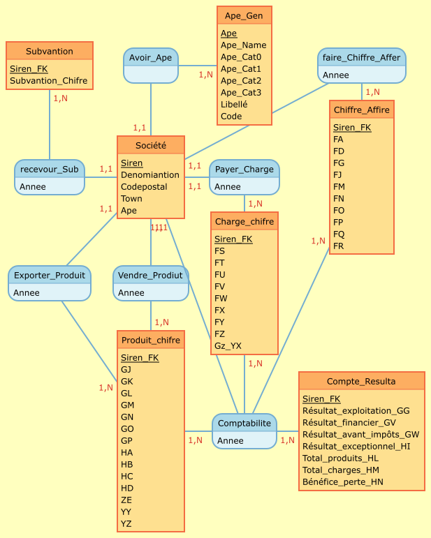{#MCD width=8cm height=10cm }  

- Pour le MOD, inclure les images réalisée avec le logiciel MySQL, telle que celles visible sur la Figure ci-dessous :

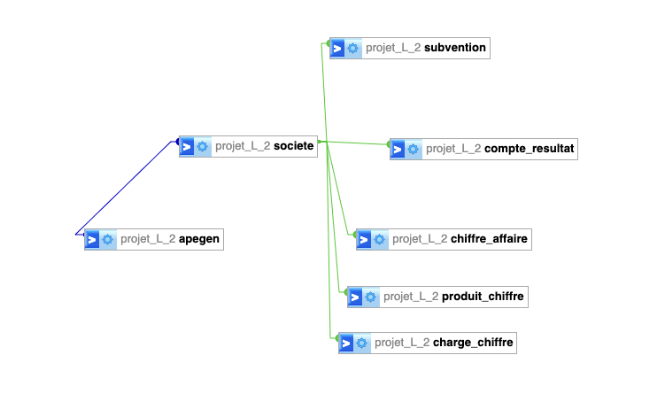{#M0D width=10cm height=5cm}


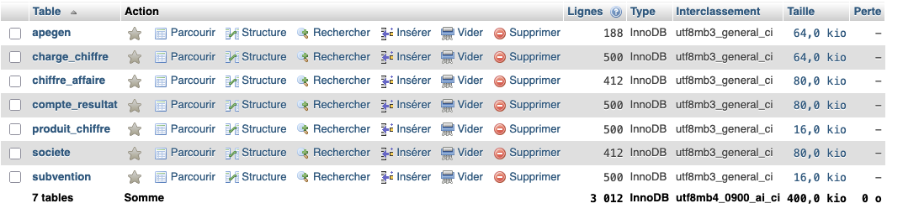{#MOD_total width=15cm height=5cm}


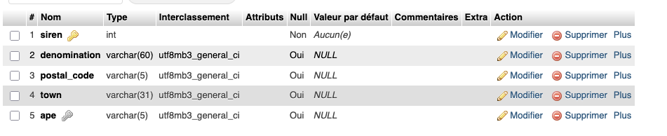{#Societe width=15cm height=5cm}


{#charge_chiffre width=15cm height=5cm}


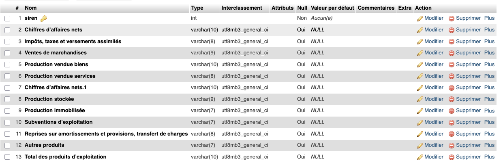{#Chiffre_affaire width=15cm height=5cm}


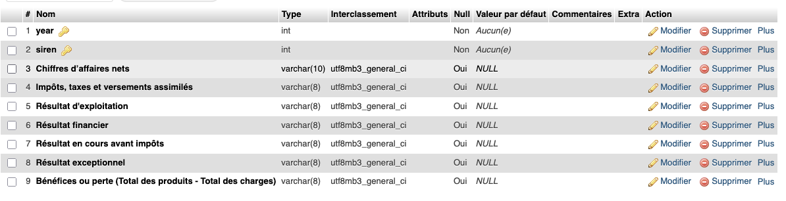{#compte_resulta width=15cm height=5cm}


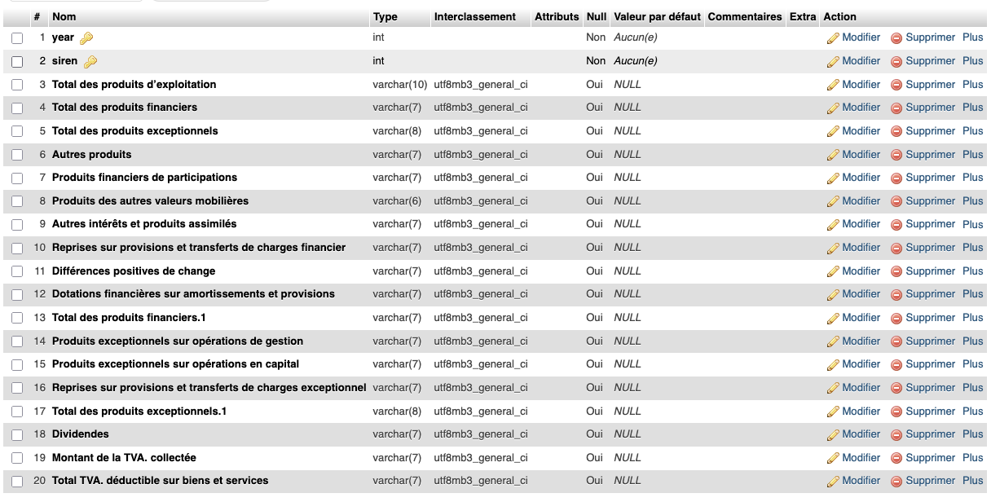{#produit_chiffre width=15cm height=5cm}


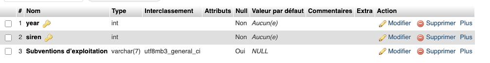{#subvention width=15cm height=3cm}


\newpage

\bigskip
## Import des données 
<!-- hazem inbmtar -->
\bigskip

Dans un premier temps, les données ont été chargées dans R à l'aide de la fonction $read\_csv()$.
Ensuite, afin de faciliter l'importation de ces données dans phpMyAdmin, nous avons procédé à
un découpage (slicing) de la base initiale en sept tables distinctes, chacune regroupant les
variables pertinentes pour son thème spécifique.

\medskip

Par exemple, pour la table *"société"*, nous avons conservé uniquement les colonnes suivantes :
*"siren", "denomination", "postal_code", "town" et "ape".*

Ce processus a été appliqué à chaque table en sélectionnant les attributs nécessaires, puis
nous avons limité chaque sous-table à ses 300 premières lignes afin de simplifier les tests
d’importation.

\medskip

Enfin, les tables ont été exportées au format CSV à l’aide de la fonction $write\_csv$.

\medskip

Dans un premier temps, nous avions extrait les **300** premières lignes de la base de données
globale. Toutefois, afin d'obtenir un échantillon plus équilibré et représentatif dans le
temps, nous avons modifié notre approche : nous avons sélectionné les **100 premières** lignes
pour chaque année, de **2012** à **2016.**

\medskip

Pour cela, nous avons utilisé la bibliothèque sqldf dans R, qui permet d'exécuter des requêtes
SQL directement sur des data frames. Par exemple, pour extraire les données de l’année 2012,
nous avons utilisé la requête suivante :

````{r, eval=FALSE, echo=TRUE}


annee_2012 <- sqldf("SELECT * FROM data_kaggle WHERE year = 2012")


````

\medskip

Cette commande retourne toutes les colonnes de la base data_kaggle pour les lignes dont
l’année est égale à 2012.

\medskip

Nous avons ensuite appliqué la même méthode (voir le code\ref{codeR_slicing}) pour chaque année (**2013 à 2016**), puis extrait les 100 premières lignes de chaque sous-ensemble. Enfin, nous avons combiné ces sous-ensembles
afin d’obtenir une table finale regroupant **500 lignes** (100 par année). Cette nouvelle table
est ainsi mieux structurée pour les futures analyses et pourra être importée dans phpMyAdmin
pour les étapes suivantes de notre projet.

\medskip

Lors de l’importation de données sur phpMyAdmin, on a rencontré un petit problème : la colonne
était trop longue pour être insérée dans la table. Du coup, on a modifié simplement le nom de
la colonne. Elle était : **« Produits des autres valeurs mobilières et créances de l’actif immobilisé » ** 
et on l’a changée pour : **« Produits des autres valeurs mobilières »**.

\medskip

   Cette commande retourne toutes les colonnes de la base data_kaggle pour les lignes dont l’année est **égale à 2012**.
Nous avons ensuite appliqué la même méthode pour chaque année (2013 à 2016), puis extrait **les 100 premières lignes** de chaque sous-ensemble. Enfin, nous avons combiné ces sous-ensembles afin d’obtenir une **table finale regroupant 500 lignes (100 par année)**. Cette nouvelle table est ainsi mieux structurée pour les futures analyses et pourra être **importée dans phpMyAdmin** pour les étapes suivantes de notre projet.

\newpage


\newpage

## Requêtes réalisées


Pour chaque requête, l'exprimer en langage naturel puis en SQL. Puis donner le résultat obtenu (ou un extrait) et expliquer ce résultat.

L'objectif est de varier le type de requêtes et de répondre à votre problématique initiale.


1) Pour comperer et trouver selon leur code postal 
<!-- serdar varol -->


```{sql,eval=FALSE,echo=TRUE,}

SELECT 
    LEFT(postal_code, 2) AS departement,
    COUNT(*) AS nombre_entreprises
FROM 
    societe
WHERE 
    postal_code IS NOT NULL
GROUP BY 
    departement
ORDER BY 
    nombre_entreprises DESC;


```


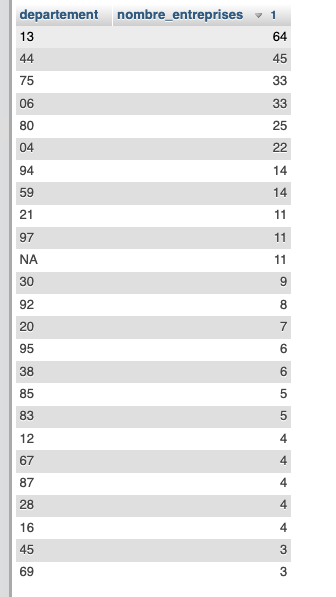{ width=5cm height=10cm}

\newpage

```{sql,eval=FALSE,echo=TRUE,}
SELECT 
    s.siren,
    s.denomination,
    s.postal_code,
    cr.`Chiffres d'affaires nets` AS chiffre_affaires_net
FROM 
    societe s
JOIN 
    compte_resultat cr ON s.siren = cr.siren
WHERE 
    LEFT(s.postal_code, 2) = '44';


```

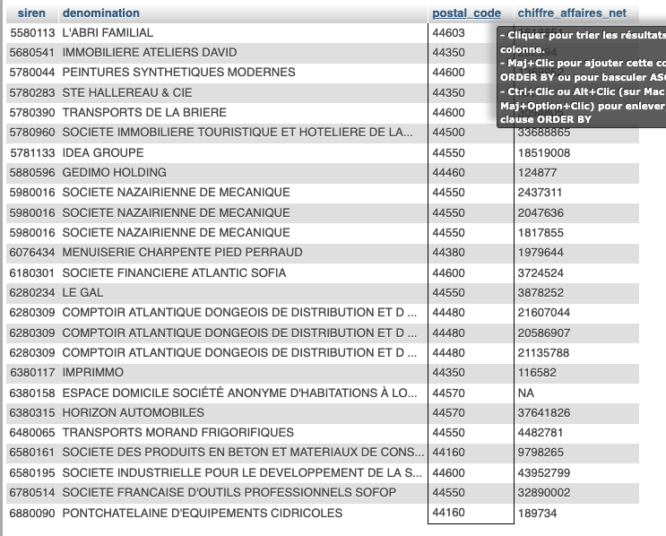{ width=10cm height=10cm}


# Matériel et Méthodes

## Logiciels

Nous avons utilisé ces logiciels lors de la réalisation de notre projet :


  - Pretraitment : Libre Office
  - Stocker Base Donnée : Mysql /MAMP
  - Traitment statistique et ecrit: R
  - Correction/ replacement:  Regex
  - Version control : GitHUB
  - L'IA : OpenAI et MISTRAL
  


\bigskip

Voici lien de github notre projet :  \href{https://github.com/serdarvarl/Project_DataBase_FR.git}{TDDT github}
 


## Modélisation statistique


<http://biostatisticien.eu/springeR/livreR.pdf>


# Analyse et Résultats

## **Comparer les catégories d'entreprises en fonction des Chiffres d'affaires nets**

<!-- lydia Moutchachou -->

\bigskip
**Variables :** Chiffres d’affaires nets , catégories (Effectif moyen du personnel)

#### Les catégories d’entreprises :
\bigskip
\scriptsize
\begin{quote}
\textit{L’article 51 de la loi n°2008-776 du 4 août 2008 de modernisation de l’économie (\textbf{LME}) détermine, pour les besoins de l’analyse statistique, un classement des entreprises en quatre catégories : les microentreprises, les petites et moyennes entreprises (\textbf{PME}), les entreprises de taille intermédiaire (\textbf{ETI}) et les grandes entreprises.\\ \\Le décret n° 2008-1354 du 18 décembre 2008 précise les critères permettant de déterminer l’appartenance à une catégorie d'entreprises.}
\end{quote}
\normalsize

\begin{itemize}[label=$\circ$]
  \item \textnormal{ \textbf{La microentreprise} est une entreprise dont l'effectif est inférieur à 10 personnes et dont le chiffre d'affaires ou le total du bilan annuel n'excède pas 2 millions d'euros}
\item \textnormal{ \textbf{la PME} est une entreprise dont l’effectif est inférieur à 250 personnes
et dont le chiffre d’affaires annuel n'excède pas 50 millions d'euros ou
dont le total de bilan n'excède pas 43 millions d'euros }
\item \textnormal{\textbf{L'ETI}, entreprise de taille intermédiaire, est une entreprise qui n'appartient pas à la catégorie des PME, dont l’effectif est inférieur à 5000 personnes et dont le chiffre d'affaires annuel n'excède pas 1 500 millions d'euros ou dont le total de bilan n'excède pas 2 000 millions d'euros}
\item \textnormal{\textbf{La grande entreprise} est une entreprise qui ne peut pas être classée
dans les catégories précédentes}
\end{itemize}
````{r pretraitment_lydia, eval=TRUE,echo=FALSE}

#🟢 Lire le fichier CSV

library(readr)
data_kaggle <- read_csv("csv/data_kaggle.csv")

#🟢 extraire information des colonnes : 

library(dplyr)

kaggle_new <- data_kaggle %>%
  select(siren, ape, `Effectif moyen du personnel`, `Chiffres d’affaires nets`, year)

#head(kaggle_new) # verifier les noms des colonnes 

#🟢 suprimes toutes le ligne ou il y'a au moins une valeur manquante 

kaggle_new <- na.omit(kaggle_new)

#🟢 Séparer les données par année

kaggle_2012 <- kaggle_new %>% filter(year == 2012)
kaggle_2013 <- kaggle_new %>% filter(year == 2013)
kaggle_2014 <- kaggle_new %>% filter(year == 2014)
kaggle_2015 <- kaggle_new %>% filter(year == 2015)
kaggle_2016 <- kaggle_new %>% filter(year == 2016)


#🟢 Vérifier les premières lignes de chaque tableau

#head(kaggle_2012)  # Affiche les 6 premières lignes du tableau de 2012
#head(kaggle_2013)  # Affiche les 6 premières lignes du tableau de 2013
#head(kaggle_2014)  # Affiche les 6 premières lignes du tableau de 2014
#head(kaggle_2015)  # Affiche les 6 premières lignes du tableau de 2015
#head(kaggle_2016)  # Affiche les 6 premières lignes du tableau de 2016


#🟢 Renommer la colonne pour éviter les caractères spéciaux
colnames(kaggle_2012)[colnames(kaggle_2012) == "Chiffres d’affaires nets"] <- "Chiffres_d_affaires_nets"
colnames(kaggle_2013)[colnames(kaggle_2013) == "Chiffres d’affaires nets"] <- "Chiffres_d_affaires_nets"
colnames(kaggle_2014)[colnames(kaggle_2014) == "Chiffres d’affaires nets"] <- "Chiffres_d_affaires_nets"
colnames(kaggle_2015)[colnames(kaggle_2015) == "Chiffres d’affaires nets"] <- "Chiffres_d_affaires_nets"
colnames(kaggle_2016)[colnames(kaggle_2016) == "Chiffres d’affaires nets"] <- "Chiffres_d_affaires_nets"

#🟢 Créer une fonction pour ajouter la colonne 'categorie'
ajouter_categorie <- function(data) {
  data %>%
    mutate(categorie = case_when(
      `Effectif moyen du personnel` < 10 & `Chiffres_d_affaires_nets` <= 2000000 ~ "Microentreprise",
      `Effectif moyen du personnel` < 250 & `Chiffres_d_affaires_nets` <= 50000000 ~ "PME",
      `Effectif moyen du personnel` < 5000 & `Chiffres_d_affaires_nets` <= 1500000000 ~ "ETI",
      TRUE ~ "Grande entreprise"
    ))
}

#🟢 Appliquer cette fonction à chaque tableau annuel
kaggle_2012 <- ajouter_categorie(kaggle_2012)
kaggle_2013 <- ajouter_categorie(kaggle_2013)
kaggle_2014 <- ajouter_categorie(kaggle_2014)
kaggle_2015 <- ajouter_categorie(kaggle_2015)
kaggle_2016 <- ajouter_categorie(kaggle_2016)

#🟢 Vérifier les premières lignes de chaque tableau après modification

#head(kaggle_2012)
#head(kaggle_2013)
#head(kaggle_2014)
#head(kaggle_2015)
#head(kaggle_2016)


````

\newpage

### Test Statistique :  ANOVA

\medskip

#### **2012**

\medskip

````{r ,eval=TRUE,echo=FALSE}
#Vérifier la structure des données de 2012
  #str(kaggle_2012) # s'assurer que les colonnes sont bien au bon format avant d'appliquer le test l'ANOVA

# Lancer l’ANOVA
  anova_result2012 <- aov(`Chiffres_d_affaires_nets` ~ categorie, data = kaggle_2012)

````

````{r,eval=TRUE,echo=FALSE}
# Afficher les résultats
  summary(anova_result2012)

````

- Détail du test : 

- **Df** : Cela indique les degrés de liberté pour chaque facteur (ici *categorie*) et les résidus.  
Nous avons 2 degrés de liberté pour les catégories et 204 pour les résidus.

- **Sum Sq** : La somme des carrés, qui mesure la variation expliquée par chaque facteur (ici, la variation expliquée par la catégorie d’entreprise) et par les résidus (erreur).

- **Mean Sq** : La moyenne des carrés, obtenue en divisant la somme des carrés par les degrés de liberté. Cela permet d’avoir une idée de la variance.

- **F value** : Le rapport entre la variance expliquée par les catégories et la variance résiduelle (erreur).  
Un F élevé (ici 817.9) indique qu'il existe une grande différence entre les groupes.

- **Pr(>F)** : La p-value associée au test F. Elle est ici inférieure à 2e-16, ce qui est très significatif.

- **Test de Signification**  
La p-value obtenue est extrêmement faible (< 2e-16), ce qui signifie que nous rejetons l'hypothèse nulle (H0) au seuil de signification de 5 % (0.05).  
En d'autres termes, il y a une différence statistiquement significative entre les moyennes des Chiffres d’affaires nets des différentes catégories d’entreprises.

- **Que signifie cette différence ?**   
Cela signifie que les entreprises de catégories différentes (par exemple, Microentreprise, PME, ETI, Grande entreprise) ont des Chiffres d’affaires nets très différents.  
Il est donc évident qu'une entreprise de type *Microentreprise* n'a pas la même performance en termes de chiffre d'affaires net qu'une PME ou une Grande entreprise.

- **Résumé**  
En 2012, les Chiffres d’affaires nets varient de manière significative en fonction de la catégorie d'entreprise.  
Cela signifie que les Microentreprises ne génèrent pas le même chiffre d'affaires net que les PME ou les Grandes entreprises.


\newpage


#### **2013**

\medskip

````{r ,eval=TRUE,echo=FALSE}
#Vérifier la structure des données de 2013
#str(kaggle_2013) # s'assurer que les colonnes sont bien au bon format avant d'appliquer le test l'ANOVA
          
#Lancer l’ANOVA
anova_result2013 <- aov(`Chiffres_d_affaires_nets` ~ categorie, data = kaggle_2013)
          
````

````{r,eval=TRUE,echo=FALSE}
# Afficher les résultats
summary(anova_result2013)

````

\medskip

- Détails du test  :

\medskip
    
- **Df** (degrés de liberté) : categorie : 2 (ce qui correspond à 3 catégories de classification : Microentreprise, PME, Grande entreprise)
 
- **Residuals** : 1102 (le nombre de données restantes après l application des catégories)


- **Sum Sq** (somme des carrés) : Pour la variable categorie, la somme des carrés est de 2.160e+17. Cela représente la variation expliquée par les différences entre les catégories.Pour les résidus, la somme des carrés est de 2.423e+17. Cela représente la variation non expliquée, c est-à-dire celle qui est attribuée aux erreurs ou à des facteurs non pris en compte dans le modèle.

- **Mean Sq** (moyenne des carrés) : Pour categorie, la moyenne des carrés est de 1.080e+17. Pour les résidus, la moyenne des carrés est de 2.198e+14.

- **F value** : La valeur de F est de 491.2, ce qui est très élevé. Cela indique une forte variation entre les catégories par rapport à la variation résiduelle.

- **Pr(>F)** : La valeur p associée à ce test est < 2e-16, ce qui est très inférieur à 0.05. Cela signifie que les différences entre les catégories sont statistiquement significatives.


- **Interprétation des résultats** : Le test ANOVA montre que la variable "Chiffres d'affaires nets" varie de manière significative en fonction de la catégorie dentreprise (Microentreprise, PME, Grande entreprise). La valeur p très faible (< 2e-16) nous permet de conclure que les moyennes des chiffres daffaires nets sont significativement différentes selon les catégories dentreprises.En dautres termes, il y a des différences importantes dans les chiffres daffaires nets entre les différentes catégories d entreprises (Microentreprises, PME et Grandes entreprises) pour lannée 2013.


- **Conclusion** : Le test ANOVA révèle que la taille de l entreprise (catégorie) est un facteur qui a un impact important sur le chiffre d affaires net des entreprises pour lannée 2013.

\newpage

 *Representation graphique boite a moustaches : *

````{r ,eval=TRUE,echo=FALSE, fig.width=5, fig.heigth= 4}

 ggplot(kaggle_2013, aes(x = categorie, y = Chiffres_d_affaires_nets, fill = categorie)) +
            geom_boxplot() +
            labs(
              title = paste(strwrap("Boîte à moustaches des Chiffres d'affaires nets selon la catégorie (2013)", width = 40), collapse = "\n"),
              x = "Catégorie d'entreprise",
              y = "Chiffres d'affaires nets"
            ) +
            theme_minimal() +
            theme(
              plot.title = element_text(hjust = 0.5, face = "bold"),
              axis.text.x = element_text(angle = 45, hjust = 1)
            )


````


#### **2014**


````{r ,eval=TRUE,echo=FALSE}
#Vérifier la structure des données de 2013
#str(kaggle_2013) # s'assurer que les colonnes sont bien au bon format avant d'appliquer le test l'ANOVA
          
#Lancer l’ANOVA
anova_result2014 <- aov(`Chiffres_d_affaires_nets` ~ categorie, data = kaggle_2014)
          
````

````{r,eval=TRUE,echo=FALSE}
# Afficher les résultats
summary(anova_result2014)
````


 - Détails du test :

\medskip

- **Df (degrés de liberté)** : La variable 'categorie' a 3 degrés de liberté, ce qui correspond à 4 catégories : Microentreprise, PME, ETI, et Grande entreprise. Les résidus ont 2716 degrés de liberté, correspondant au nombre de données restantes après l'application des catégories.

- **Sum Sq (somme des carrés)** : Pour la variable 'categorie', la somme des carrés est de 5.252e+19, ce qui représente la variation expliquée par les différences entre les catégories. Pour les résidus, la somme des carrés est de 4.253e+19, représentant la variation non expliquée par le modèle.

- **Mean Sq (moyenne des carrés)** : La moyenne des carrés pour 'categorie' est de 1.751e+19, La moyenne des carrés pour les résidus est de 1.566e+16.

- **F value** : La valeur de F est très élevée, à 1118, ce qui montre qu'il existe une grande différence entre les groupes par rapport à la variation résiduelle. Une valeur de F élevée signifie que les différences entre les groupes sont beaucoup plus grandes que la variation interne à chaque groupe.

- **Pr(>F)** : La valeur p associée à ce test est inférieure à 2e-16, ce qui est bien en dessous du seuil de 0.05.  Cela montre que les différences entre les catégories sont très significatives, ce qui nous permet de rejeter l'hypothèse nulle selon laquelle il n'y a pas de différence entre les catégories.

- **Interprétation des résultats** : Le test ANOVA montre que la variable 'Chiffres_d_affaires_nets' varie de manière significative en fonction de la catégorie d'entreprise (Microentreprise, PME, ETI, Grande entreprise). La valeur p très faible (< 2e-16) indique que les moyennes des chiffres d'affaires nets sont statistiquement différentes selon les catégories d'entreprises. Cela signifie que l'appartenance à une catégorie d'entreprise (Microentreprise, PME, ETI, Grande entreprise) a un impact significatif sur les chiffres d'affaires nets pour l'année 2014.

- **Conclusion** : Le test ANOVA confirme que la taille de l'entreprise (catégorie) influence le chiffre d'affaires net des entreprises en 2014. En comparant les moyennes des différentes catégories (Microentreprises, PME, ETI, et Grandes entreprises), on peut dire qu'il y a des différences marquées dans les chiffres d'affaires entre ces groupes.

 - Representation graphique boite a moustaches : 
    

````{r ,eval=TRUE,echo=FALSE, fig.width=5, fig.heigth= 4}
    
    
    ggplot(kaggle_2014, aes(x = categorie, y = Chiffres_d_affaires_nets, fill = categorie)) +
      geom_boxplot() +
      labs(
        title = paste(strwrap("Boîte à moustaches des Chiffres d'affaires nets selon la catégorie (2014)", width = 40), collapse = "\n"),
        x = "Catégorie d'entreprise",
        y = "Chiffres d'affaires nets"
      ) +
      theme_minimal() +
      theme(
        plot.title = element_text(hjust = 0.5, face = "bold"),
        axis.text.x = element_text(angle = 45, hjust = 1)
      )

````
\newpage

#### **2015**


````{r, eval=TRUE,echo=FALSE}
          
#  Vérifier la structure des données de 2015
#str(kaggle_2015) # s'assurer que les colonnes sont bien au bon format avant d'appliquer le test l'ANOVA
          
# Lancer l’ANOVA
  anova_result2015 <- aov(`Chiffres_d_affaires_nets` ~ categorie, data = kaggle_2015)

````
        
````{R,eval=TRUE,echo=FALSE}

#Afficher les résultats
summary(anova_result2015)

````
          

  
 - Détails du test :

\medskip

- **Df (Degrés de liberté)** : Le facteur "categorie" a 3 degrés de liberté, et les résidus (erreurs) ont 9588 degrés de liberté. Cela reflète le nombre de groupes comparés (les différentes catégories d'entreprises) et la quantité de données disponibles pour les erreurs.

- **Sum Sq (Somme des carrés)** : La somme des carrés représente la variation dans les données. La variation expliquée par la catégorie d'entreprise est de 2.864e+19, tandis que la variation résiduelle (l'erreur) est de 3.293e+19.

- **Mean Sq (Moyenne des carrés)** : La moyenne des carrés est calculée en divisant la somme des carrés par les degrés de liberté. Pour la catégorie, la moyenne des carrés est de 9.546e+18, et pour les résidus, elle est de 3.434e+15.

- **F value** : Le F-value est le rapport entre la variation expliquée par les catégories et celle des résidus. Ici, il est de 2780, ce qui est très élevé, indiquant une différence marquée entre les groupes.

- **Pr(>F)** : La p-value associée au test F. Elle est inférieure à 2e-16, ce qui est très significatif. Cela montre que la probabilité que les différences observées soient dues au hasard est extrêmement faible.

- **Test de Signification** : La p-value obtenue est extrêmement faible (< 2e-16), ce qui signifie que l'hypothèse nulle (H0), qui stipule qu'il n'y a pas de différence entre les groupes, est rejetée. Ainsi, au seuil de 5 % de signification, nous concluons qu'il existe une différence statistiquement significative entre les moyennes des chiffres d’affaires nets des différentes catégories d’entreprises.

- **Que signifie cette différence ?** : Les entreprises de catégories différentes (comme les Microentreprises, PME, ETI, et Grandes entreprises) ont des chiffres d'affaires nets très différents. Par exemple, une Microentreprise n'a clairement pas les mêmes performances financières qu'une PME ou une Grande entreprise.

- **Résumé** : En 2015, les chiffres d’affaires nets varient de manière significative selon la catégorie d'entreprise. Cela suggère que les petites entreprises (comme les Microentreprises) génèrent beaucoup moins de chiffre d'affaires net comparées aux entreprises plus grandes.

  
````{r ,eval=TRUE,echo=FALSE, fig.width=5, fig.heigth= 4}
  #Créer la boîte à moustaches : 

  #
  ggplot(kaggle_2015, aes(x = categorie, y = Chiffres_d_affaires_nets, fill = categorie)) +
    geom_boxplot() +
    labs(
      title = paste(strwrap("Boîte à moustaches des Chiffres d'affaires nets selon la catégorie (2015)", width = 40), collapse = "\n"),
      x = "Catégorie d'entreprise",
      y = "Chiffres d’affaires nets"
    ) +
    theme_minimal() +
    theme(
      plot.title = element_text(hjust = 0.5, face = "bold"),
      axis.text.x = element_text(angle = 45, hjust = 1)
    )

````


#### **2016**


````{r, eval=TRUE,echo=FALSE}
          
#  Vérifier la structure des données de 2015
#str(kaggle_2015) # s'assurer que les colonnes sont bien au bon format avant d'appliquer le test l'ANOVA
          
# Lancer l’ANOVA
  anova_result2016 <- aov(`Chiffres_d_affaires_nets` ~ categorie, data = kaggle_2016)

````
        
````{R,eval=TRUE,echo=FALSE}

#Afficher les résultats
summary(anova_result2016)

````
          

\medskip

- Détails du test :

\medskip

- **Df (Degrés de liberté)** : Le facteur "categorie" a 3 degrés de liberté, et les résidus (erreurs) ont 1358 degrés de liberté. Cela représente le nombre de groupes comparés (les différentes catégories d'entreprises) et la quantité de données restantes pour l'erreur.

- **Sum Sq (Somme des carrés)** : La somme des carrés représente la variation dans les données. La variation expliquée par la catégorie d'entreprise est de 1.092e+19, tandis que la variation résiduelle (l'erreur) est de 2.460e+19.

- **Mean Sq (Moyenne des carrés)** : La moyenne des carrés est calculée en divisant la somme des carrés par les degrés de liberté. Pour la catégorie, la moyenne des carrés est de 3.639e+18, et pour les résidus, elle est de 1.812e+16.

- **F value** : Le F-value est le rapport entre la variation expliquée par les catégories et celle des résidus. Ici, il est de 200.9, ce qui est relativement élevé, indiquant une différence entre les groupes.

- **Pr(>F)** : La p-value associée au test F. Elle est inférieure à 2e-16, ce qui est extrêmement significatif. Cela montre que la probabilité que les différences observées soient dues au hasard est très faible.

- **Test de Signification :** La p-value obtenue est extrêmement faible (< 2e-16), ce qui signifie que l'hypothèse nulle (H0), qui stipule qu'il n'y a pas de différence entre les groupes, est rejetée. Ainsi, au seuil de 5 % de signification, nous concluons qu'il existe une différence statistiquement significative entre les moyennes des chiffres d’affaires nets des différentes catégories d’entreprises.

- **Que signifie cette différence ? :** Les entreprises de catégories différentes (comme les Microentreprises, PME, ETI, et Grandes entreprises) ont des chiffres d'affaires nets très différents. Une Microentreprise n'a pas les mêmes performances financières qu'une PME ou une Grande entreprise.

- **Résumé** : En 2016, les chiffres d’affaires nets varient de manière significative en fonction de la catégorie d'entreprise. Cela suggère que les petites entreprises (comme les Microentreprises) génèrent beaucoup moins de chiffre d'affaires net comparées aux entreprises plus grandes.

\medskip

- Représentation graphique (boîte à moustaches):

````{r ,eval=TRUE,echo=FALSE, fig.width=5, fig.heigth= 4}
#  Créer la boîte à moustaches : 
  
  ggplot(kaggle_2016, aes(x = categorie, y = Chiffres_d_affaires_nets, fill = categorie)) +
    geom_boxplot() +
    labs(
      title = "Boîte à moustaches des Chiffres d’affaires nets selon la catégorie (2016)",
      x = "Catégorie d'entreprise",
      y = "Chiffres d’affaires nets"
    ) +
    theme_minimal() +
    theme(
      plot.title = element_text(hjust = 0.5, face = "bold"),
      axis.text.x = element_text(angle = 45, hjust = 1)
    )


````

\newpage

### Conclusion
\medskip
Dans cette analyse, nous avons examiné les différences de chiffre d'affaires net entre les différentes catégories d'entreprises **(Microentreprise, PME, ETI, Grande entreprise)** sur la période *2012-2016*. Les tests ANOVA ont permis de confirmer que les différences observées sont statistiquement significatives, ce qui montre que la taille de l'entreprise a un impact notable sur ses performances économiques.
\medskip
Les résultats ont montré que les Microentreprises génèrent des chiffres d'affaires nettement inférieurs à ceux des PME et des Grandes entreprises. Les boîtes à moustaches ont illustré visuellement ces différences, renforçant ainsi les conclusions des tests statistiques.
\medskip
En conclusion, cette analyse confirme que la taille de l'entreprise est un facteur déterminant dans ses résultats économiques. Ces résultats peuvent être utilisés pour guider des décisions politiques et stratégiques, notamment pour le soutien aux entreprises en fonction de leur taille.


\newpage

## **Analyse des subventions et du chiffre d'affaires**
<!-- esteban beretti -->
\medskip

L'objectif de cette section est de comprendre si les subventions reçues par les entreprises françaises ont un impact sur leur chiffre d'affaires.

Les montants des subventions et du chiffre d'affaires varient énormément entre les entreprises : certaines ne reçoivent presque rien, d'autres ont des montants très élevés. Pour rendre les données plus lisibles et éviter que quelques cas extrêmes ne faussent les résultats, on utilise une transformation logarithmique. Cela permet d'observer les tendances de manière plus équilibrée et de voir si, proportionnellement, plus de subventions entraîne plus de chiffre d'affaires.

#### 1. Nettoyage et préparation des données

\medskip

Nous avons utilisé conncetion MySQL pour examiner cette party, voici le code R:

\medskip


\footnotesize
````{r,eval= TRUE, echo = TRUE, warning=FALSE, message=FALSE}

con <- dbConnect(
  MySQL(),
  user = "root",
  password = "root", # même mot de passe créé plus haut
  dbname = "projet_L_2",
  host = "127.0.0.1",
  port = 8889
)

# Vérifie immédiatement la connexion :
#dbListTables(con)

df <- dbGetQuery(con, "
SELECT
    s.siren,
    s.denomination,
    s.town,
    s.ape,
    a.ape_name,
    cr.year,
    cr.`Chiffres d’affaires nets` AS chiffre_affaires,
    sb.`Subventions d’exploitation` AS subvention
FROM projet_L_2.societe s
JOIN projet_L_2.apegen a
  ON s.ape = a.ape
JOIN projet_L_2.compte_resultat cr
  ON s.siren = cr.siren
JOIN projet_L_2.subvention sb
  ON s.siren = sb.siren AND cr.year = sb.year
WHERE cr.`Chiffres d’affaires nets` IS NOT NULL
  AND sb.`Subventions d’exploitation` IS NOT NULL
")
````
\normalsize

\newpage

```{r,eval= TRUE, echo = TRUE, warning=FALSE, message=FALSE}
library(dplyr)
library(ggplot2)

# Nettoyage
df_clean <- df %>%
  mutate(
    chiffre_affaires = as.numeric(gsub("[^0-9]", "", chiffre_affaires)),
    subvention = as.numeric(gsub("[^0-9]", "", subvention))
  ) %>%
  filter(!is.na(chiffre_affaires) & !is.na(subvention))

# Création des colonnes logarithmiques
df_log <- df_clean %>%
  filter(chiffre_affaires > 0, subvention > 0) %>%
  mutate(
    log_CA = log10(chiffre_affaires),
    log_subvention = log10(subvention)
  )

# Régression log-log
modele_log <- lm(log_CA ~ log_subvention, data = df_log)
summary(modele_log)
```
\normalsize

\newpage

### 2. Analyse univariée

 <!-- **Distribution des subventions reçues** -->

\medskip

```{r,eval= TRUE, echo = FALSE, warning=FALSE, message=FALSE,fig.width=4,fig.height=3}
ggplot(df_clean, aes(x = subvention)) +
  geom_histogram(fill = "darkorange", bins = 30) +
  labs(title = "Distribution des subventions reçues",
       x = "Montant des subventions",
       y = "Nombre d'entreprises")
```

> La majorité des entreprises reçoivent de petites subventions. Quelques-unes, plus rares, touchent des montants bien plus élevés.

<!-- **Distribution du chiffre d'affaires** -->

\medskip

```{r,eval= TRUE, echo = FALSE, warning=FALSE, message=FALSE,fig.width=4,fig.height=3}
ggplot(df_clean, aes(x = chiffre_affaires)) +
  geom_histogram(fill = "steelblue", bins = 30) +
  labs(title = "Distribution du chiffre d'affaires",
       x = "Chiffre d'affaires",
       y = "Nombre d'entreprises")
```

> Le chiffre d'affaires est aussi très variable, certaines entreprises réalisant plusieurs dizaines de millions d'euros.

\medskip

### 3. Analyse bivariée brute

\medskip

```{r,eval= TRUE, echo = FALSE, warning=FALSE, message=FALSE,fig.width=4,fig.height=3}
ggplot(df_clean, aes(x = subvention, y = chiffre_affaires)) +
  geom_point(alpha = 0.5) +
  geom_smooth(method = "lm", color = "red") +
  labs(title = "Relation brute entre subventions et chiffre d'affaires",
       x = "Subvention",
       y = "Chiffre d'affaires")
```

> À première vue, il n'y a pas de lien clair entre les subventions et le chiffre d'affaires. Le graphique montre beaucoup de dispersion, ce qui empêche une vraie lecture de tendance.

\medskip

#### 4. Régression log-log : Visualisation

\medskip

```{r,eval= TRUE, echo = FALSE, warning=FALSE, message=FALSE,fig.width=4,fig.height=3}
ggplot(df_log, aes(x = log_subvention, y = log_CA)) +
  geom_point(color = "blue", alpha = 0.6) +
  geom_smooth(method = "lm", color = "red") +
  labs(title = "Relation log-log entre subventions et chiffre d'affaires",
       x = "log10(Subvention)",
       y = "log10(Chiffre d'affaires)")
```

> Une fois les données transformées en logarithme, une tendance apparaît : les entreprises qui reçoivent plus de subventions ont, en moyenne, un chiffre d'affaires plus élevé. La relation est significative et le modèle indique qu'une augmentation de 10% des subventions correspond à une hausse d'environ 4,5% du chiffre d'affaires.

\medskip

#### Conclusion

\medskip

En conclusion, même si à l'échelle brute le lien entre subventions et chiffre d'affaires n'est pas visible, la transformation log-log montre qu’il existe une **relation proportionnelle significative**. Cela signifie que les subventions peuvent avoir un impact positif mesurable sur le développement économique des entreprises, en particulier si l'on considère les effets relatifs plutôt que les montants absolus. sans refinancement : Total des charges financières = 0


\newpage


## **Analyser des entreprises en fonction de leur localisation géographique** 
<!-- Serdar VAROL -->
\bigskip

L’objectif de cette étude est d’analyser des entreprises en France à partir de données financières entre 2012 et 2016. Nous avons examiné **le chiffre d’affaires net**, **le résultat d’exploitation**. Des entreprises et a été examinée par **année** et par **region**. La base de données ne contenait que des codes postaux. Nous avons d’abord regroupé les départements puis les régions en fonction des deux chiffres du code postal.Nous avons examiné chaque année indépendamment. 

\medskip

Dans ce chapite pour analyse univarie, nous allons presenter l'annes 2015 car l’année avec le plus de données est 2015. Nous avons constaté que les différences et les incohérences dans la taille des données selon les années et les régions constituaient un obstacle.

\medskip

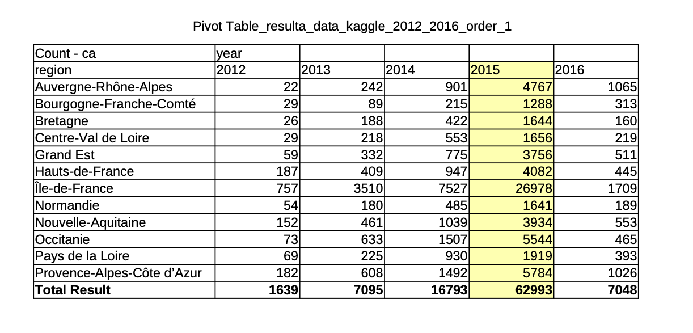{#Pivot width=10cm height=5cm}

\medskip

### Préparation des données

\medskip

1) Un fichier CSV (créé par code R) contenant les données financières de l’entreprise de 2012 à 2016 a été utilisé

\small
```{r,eval= TRUE, echo = FALSE, warning=FALSE, message=FALSE}
library(readr)
library(dplyr)
library(stringr)

# 1. Rentabilité fonction
fonction_rentabilite <- function(resultat_exp, ca) {
  if (is.na(resultat_exp) || is.na(ca) || ca == 0) {
    return(NA)
  } else {
    return((resultat_exp ) / ca)
  }
}

# categorise rentabilite 
cat_rentabilite <- function(r) {
  if (is.na(r)) {
    return("Non numérique")
  } else if (r < 0) {
    return("En perte")
  } else if (r < 0.1) {
    return("Faible rentabilité")
  } else if (r < 0.3) {
    return("Rentabilité moyenne")
  } else {
    return("Haute rentabilité")
  }
}

#read data 
data_kaggle <- read_csv("csv/data_kaggle.csv")

# 2012 - 2016 filtre
data_subset <- data_kaggle %>%
  filter(year >= 2012, year <= 2016) %>%
  select(year,
         siren,
         resultat_exp = `Résultat d'exploitation`,
         ca = `Chiffres d’affaires nets`,
         postal_code = postal_code)

# calcule rentabulite
data_subset$rentabilite <- apply(data_subset, 1, function(row) {
  resultat_exp <- as.numeric(row["resultat_exp"])
  ca <- as.numeric(row["ca"])
  return(fonction_rentabilite(resultat_exp, ca))
})

# categorise rentabilite posser dans la csv
data_subset$categorie_rentabilite <- sapply(data_subset$rentabilite, cat_rentabilite)

# ajouter code postal et department
data_subset$code_postal <- str_pad(as.character(data_subset$postal_code), 5, side = "left", pad = "0")
data_subset$departement <- substr(data_subset$code_postal, 1, 2)

# Département -> Région convertir
departement_to_region <- c(
  "01"="Auvergne-Rhône-Alpes", "02"="Hauts-de-France", "03"="Auvergne-Rhône-Alpes", 
  "04"="Provence-Alpes-Côte d'Azur", "05"="Provence-Alpes-Côte d'Azur", "06"="Provence-Alpes-Côte d'Azur",
  "07"="Auvergne-Rhône-Alpes", "08"="Grand Est", "09"="Occitanie", "10"="Grand Est", "11"="Occitanie",
  "12"="Occitanie", "13"="Provence-Alpes-Côte d'Azur", "14"="Normandie", "15"="Auvergne-Rhône-Alpes",
  "16"="Nouvelle-Aquitaine", "17"="Nouvelle-Aquitaine", "18"="Centre-Val de Loire", "19"="Nouvelle-Aquitaine",
  "2A"="Corse", "2B"="Corse", "21"="Bourgogne-Franche-Comté", "22"="Bretagne", "23"="Nouvelle-Aquitaine",
  "24"="Nouvelle-Aquitaine", "25"="Bourgogne-Franche-Comté", "26"="Auvergne-Rhône-Alpes",
  "27"="Normandie", "28"="Centre-Val de Loire", "29"="Bretagne", "30"="Occitanie",
  "31"="Occitanie", "32"="Occitanie", "33"="Nouvelle-Aquitaine", "34"="Occitanie", "35"="Bretagne",
  "36"="Centre-Val de Loire", "37"="Centre-Val de Loire", "38"="Auvergne-Rhône-Alpes", "39"="Bourgogne-Franche-Comté",
  "40"="Nouvelle-Aquitaine", "41"="Centre-Val de Loire", "42"="Auvergne-Rhône-Alpes",
  "43"="Auvergne-Rhône-Alpes", "44"="Pays de la Loire", "45"="Centre-Val de Loire", "46"="Occitanie",
  "47"="Nouvelle-Aquitaine", "48"="Occitanie", "49"="Pays de la Loire", "50"="Normandie",
  "51"="Grand Est", "52"="Grand Est", "53"="Pays de la Loire", "54"="Grand Est", "55"="Grand Est",
  "56"="Bretagne", "57"="Grand Est", "58"="Bourgogne-Franche-Comté", "59"="Hauts-de-France",
  "60"="Hauts-de-France", "61"="Normandie", "62"="Hauts-de-France", "63"="Auvergne-Rhône-Alpes",
  "64"="Nouvelle-Aquitaine", "65"="Occitanie", "66"="Occitanie", "67"="Grand Est", "68"="Grand Est",
  "69"="Auvergne-Rhône-Alpes", "70"="Bourgogne-Franche-Comté", "71"="Bourgogne-Franche-Comté",
  "72"="Pays de la Loire", "73"="Auvergne-Rhône-Alpes", "74"="Auvergne-Rhône-Alpes",
  "75"="Île-de-France", "76"="Normandie", "77"="Île-de-France", "78"="Île-de-France",
  "79"="Nouvelle-Aquitaine", "80"="Hauts-de-France", "81"="Occitanie", "82"="Occitanie",
  "83"="Provence-Alpes-Côte d'Azur", "84"="Provence-Alpes-Côte d'Azur", "85"="Pays de la Loire",
  "86"="Nouvelle-Aquitaine", "87"="Nouvelle-Aquitaine", "88"="Grand Est", "89"="Bourgogne-Franche-Comté",
  "90"="Bourgogne-Franche-Comté", "91"="Île-de-France", "92"="Île-de-France", "93"="Île-de-France",
  "94"="Île-de-France", "95"="Île-de-France", "971"="Guadeloupe", "972"="Martinique",
  "973"="Guyane", "974"="La Réunion", "976"="Mayotte"
)

# ajouter region
data_subset$departement <- as.character(data_subset$departement)
data_subset$region <- departement_to_region[data_subset$departement]

# save dernirer version csv
write_csv(data_subset, "csv/resulta_data_kaggle_2012_2016_order.csv")
#View(data_subset)
```
\normalsize

2) Les Variables sont utilise:

|  Variable |source   |
|---|---|
|Year  |Datakagle.csv   |
|Siren  |Datakagle.csv   |
|résultat d'exploitation  |Datakagle.csv |
|chiffres d’affaires nets  |Datakagle.csv   |
|code_postal  |Datakagle.csv   |
|rentabilite  |créé   |
|categorie_rentabilite  |créé    |
|Department  |créé    |
|region  |créé    |


\medskip

3) Création d'une variable catégorielle : La valeur de rentabilité est divisée dans les classes suivantes :

$$
      \text{rentabilité} = \frac{\text{résultat d'exploitation}}{\text{chiffres d’affaires nets}}
$$

\medskip

Table: Classification des entreprises selon leur rentabilité

| Intervalle de rentabilité | Catégorie |
|---------------------------|-----------|
| Rentabilité $< 0$         | En perte  |
| $0 \leq$ Rentabilité $< 0{,}1$ | Faible rentabilité |
| $0{,}1 \leq$ Rentabilité $< 0{,}3$ | Rentabilité moyenne |
| Rentabilité $\geq 0{,}3$  | Haute rentabilité |

\medskip

````{r rentabilite,eval=TRUE, echo=FALSE,message=FALSE,warning=FALSE,fig.width=5}


# filtre non numerique
data_pie <- data_subset %>%
  filter(categorie_rentabilite != "Non numérique") %>%
  group_by(year, categorie_rentabilite) %>%
  summarise(count = n(), .groups = "drop") %>%
  group_by(year) %>%
  mutate(percentage = count / sum(count) * 100)

# dessiner camembert 
ggplot(data_pie, aes(x = "", y = percentage, fill = categorie_rentabilite)) +
  geom_bar(stat = "identity", width = 1) +
  coord_polar("y") +
  facet_wrap(~ year) +
  labs(
    title = "Répartition des catégories de rentabilité par année",
    fill = NULL
  ) +
  theme_void() +
  theme(
    legend.position = "bottom",
    legend.text = element_text(size = 9),
    plot.title = element_text(hjust = 0.5, size = 14)
  ) +
  guides(fill = guide_legend(nrow = 2, byrow = TRUE))


````

\newpage 

### Analyse Univarie

\medskip

#### Chifre d'afffaire

```{r chiffre_affaire_summary_2015, echo=FALSE, message=FALSE, warning=FALSE ,fig.width=4, fig.height=3}

library(dplyr)
library(kableExtra)

# filtre 2015
summary_ca <- data_subset %>%
  filter(!is.na(region), year == 2015) %>%
  group_by(region) %>%
  summarise(
    avarage = mean(ca, na.rm = TRUE),
    median = median(ca, na.rm = TRUE),
    min = min(ca, na.rm = TRUE),
    max = max(ca, na.rm = TRUE),
    ecart_type = sd(ca, na.rm = TRUE),
    .groups = "drop"
  )

# million pour pdf
summary_ca_fmt <- summary_ca %>%
  mutate(across(c(avarage, median, min, max, ecart_type), ~ round(. / 1e6, 2)))

# latex tableau
summary_ca_fmt %>%
  kable(format = "latex", booktabs = TRUE, longtable = TRUE,
        caption = "Résumé des statistiques du chiffre d'affaires nets (en millions d'euros) – 2015") %>%
  kable_styling(latex_options = c("scale_down", "repeat_header"))


# write_csv(summary_ca, "summary_chiffre_affaires_2015.csv")

```


````{r chiffre_affaire_graph_2015, echo=FALSE, message=FALSE, warning=FALSE,fig.width=4, fig.height=3}
library(ggplot2)

#Boxplot  Chiffre d'affaires (2015, max y = 4000)

ggplot(data_subset %>% filter(year == 2015, !is.na(region)),
       aes(x = region, y = ca / 1e6)) +
  geom_boxplot(outlier.color = "red") +
  coord_flip() +
  ylim(0, 3000) +  # Y max 3000
  labs(title = "Boxplot du chiffre d'affaires par région (2015)",
       y = "Chiffre d'affaires nets (millions euro)", x = "Région") +
  theme_minimal(base_size = 9)


````


\newpage 


#### Resultat d'Explation 

````{r resultat_exp_summary_2015, echo=FALSE, message=FALSE, warning=FALSE}
# Résultat d'exploitation (resultat_exp) pour tableu
summary_resultat <- data_subset %>%
  filter(!is.na(region), year == 2015) %>%
  group_by(region) %>%
  summarise(
    avarage = mean(resultat_exp, na.rm = TRUE),
    median = median(resultat_exp, na.rm = TRUE),
    min = min(resultat_exp, na.rm = TRUE),
    max = max(resultat_exp, na.rm = TRUE),
    ecart_type = sd(resultat_exp, na.rm = TRUE),
    .groups = "drop"
  )

#print(summary_resultat)
# write_csv(summary_resultat, "summary_resultat_exploitation_by_year_region.csv")


# PDF million 
summary_Res_fmt <- summary_resultat %>%
  mutate(across(c(avarage, median, min, max, ecart_type), ~ round(. / 1e6, 2)))

# latex tableur sinon bordel qsdqsdqsdqsd
summary_ca_fmt %>%
  kable(format = "latex", booktabs = TRUE, longtable = TRUE,
        caption = "Résumé des statistiques du Résultat d'exploitation (en millions d'euros) – 2015") %>%
  kable_styling(latex_options = c("scale_down", "repeat_header"))

#write_csv(summary_table,"csv/summary_test.csv")
#View(summary_table)
#print(summary_table)


````


````{r resulta_graph_2015, echo=FALSE, message=FALSE, warning=FALSE,fig.width=4, fig.height=3}

library(ggplot2)

# Boxplot – Chiffre d'affaires (2015, max y = 4000)
ggplot(data_subset %>% filter(year == 2015, !is.na(region)), 
       aes(x = region, y = resultat_exp / 1e6)) +
  geom_boxplot(outlier.color = "red") +
  coord_flip() +
  ylim(0, 1500) +  # Y max 4000
  labs(title = "Boxplot du Résultat d'exploitation par région (2015)",
       y = "Résultat d'exploitation (millions euro)", x = "Région") +
  theme_minimal(base_size = 9)


````


\newpage

### Analyse Bivarie
 \medskip
 
#### Chiffre d’affaires nets et Résultat d'exploitation
 
````{r nuage_point_anness,eval=TRUE, echo=FALSE,message=FALSE, warning=FALSE,fig.width=5, fig.height=3}
ggplot(data_subset, aes(x = ca/1e6, y = resultat_exp/1e6)) +
  geom_point(alpha = 0.4, color = "darkred") +
  facet_wrap(~year) +
  labs(
    title = "Relation entre Chiffre d'affaires et Résultat d'exploitation",
    x = "Chiffre d'affaires (millions euro)",
    y = "Résultat d'exploitation (millions euro)"
  ) +
  theme_minimal()

````

#### Coefficient de corrélation de Pearson
 
\medskip

````{r correlation_annee, eval=TRUE, echo=FALSE,message=FALSE, warning=FALSE,fig.width=5, fig.height=3}

for (yr in unique(data_subset$year)) {
  df_year <- data_subset %>% filter(year == yr)
  cor_val <- cor(df_year$ca, df_year$resultat_exp, use = "complete.obs", method = "pearson")
  #print(paste("Année", yr, ": corrélation =", round(cor_val, 3)))
}


````


| Année  | Corrélation (Pearson)  | Interprétation  |
|--------|---|---|
|2012|-0.45    |Corrélation négative modérée   |
|2013|0.35     |Relation positive modérée   |
|2014|0.80     |Forte corrélation positive    |
|2015|0.38     |Tendance positive similaire à 2013   |
|2016|0.29     |Corrélation positive mais faible   |

\medskip


La corrélation doit être comprise entre **-1 et 1**, donc les valeurs que nous avons trouvées sont correctes.
On peut dire qu'en 2012, il existe une relation **négative** entre les deux variables.
Pour les années 2013, 2015 et 2016, la corrélation est **faible mais positive** : cela signifie que lorsque le chiffre d'affaires augmente, le résultat d'exploitation a tendance à augmenter également.
En 2014, on observe une **forte** corrélation positive, ce qui indique une relation claire entre les deux variables : elles ont tendance à évoluer dans le même sens, c’est-à-dire à augmenter en même temps.


\newpage

#### Regreation droit


````{r reg_droit,eval= TRUE, echo=FALSE, message=FALSE,warning=FALSE,fig.width=5, fig.height=3}
ggplot(data_subset, aes(x = ca/1e6, y = resultat_exp/1e6)) +
  geom_point(alpha = 0.3, color = "brown") +
  geom_smooth(method = "lm", color = "blue") +
  facet_wrap(~year) +
  labs(title = "Régression linéaire entre CA et Résultat d'exploitation",
       x = "Chiffre d'affaires (millions euro)", y = "Résultat (millions euro)") +
  theme_minimal()


````

\medskip

**Formuler les hypothèses :**

\bigskip

- Hypothèse nulle (H\textsubscript{0}) : La répartition du chiffre d’affaires net et du résultat d'exploitation ne varie pas selon les régions.
\medskip
- Hypothèse alternative (H\textsubscript{1}) : Il existe une différence significative du chiffre d’affaires net et du résultat d'exploitation entre les régions.


```{r, eval=TRUE,echo=FALSE}
years <- unique(data_subset$year)


# trigger liste
ca_anova_resume <- list()

for (yr in years) {
  df_year <- data_subset %>%
    filter(year == yr, !is.na(ca), !is.na(region))

  df_year$region <- as.factor(df_year$region)
  model <- aov(ca ~ region, data = df_year)
  s <- summary(model)

  # F et P value
  row <- s[[1]][1, c("F value", "Pr(>F)")]
  f_val <- round(row[[1]], 2)
  p_val <- formatC(row[[2]], format = "f", digits = 9)  # P değeri 4 haneli
  decision <- ifelse(p_val < 0.05, "H0 rejetée", "H0 non rejetée")

  ca_anova_resume[[as.character(yr)]] <- data.frame(
    Annee = yr,
    F_value = f_val,
    p_value = p_val,
    Decision = decision
  )
}

# merging liste
ca_anova_resume <- do.call(rbind, ca_anova_resume)

# afficer resume 

ca_anova_resume

```

\bigskip


```{r ,eval= TRUE,echo = FALSE}
# startin gliste
resultat_anova_resume <- list()

for (yr in years) {
  df_year <- data_subset %>%
    filter(year == yr, !is.na(resultat_exp), !is.na(region))

  df_year$region <- as.factor(df_year$region)
  model <- aov(resultat_exp ~ region, data = df_year)
  s <- summary(model)

  # F et P value
  row <- s[[1]][1, c("F value", "Pr(>F)")]
  f_val <- round(row[[1]], 2)
  p_val <- formatC(row[[2]], format = "f", digits = 4)  # P değeri 4 haneli
  decision <- ifelse(as.numeric(p_val) < 0.05, "H0 rejetée", "H0 non rejetée")

  resultat_anova_resume[[as.character(yr)]] <- data.frame(
    Annee = yr,
    F_value = f_val,
    p_value = p_val,
    Decision = decision
  )
}

# merging liste
resultat_anova_resume <- do.call(rbind, resultat_anova_resume)

# afficer resume
print(resultat_anova_resume)


```

#### Conclusion


once upon a time in montpellier....


\newpage


## **Comparer  des Chiffres d’affaires net et Impôts, taxes et versements assimilés**
<!-- Hazem IBNMTAR -->
\medskip

Filtrer les valeurs strictement positives

\medskip

\scriptsize
````{r eval=TRUE,echo=FALSE, message=FALSE, warning=FALSE,fig.width=5, fig.height=4}
ca_nets_pos <- data_kaggle$`Chiffres d’affaires nets`
summary(ca_nets_pos,na.rm = TRUE)

````
\normalsize

\medskip

Minimum négatif (-32,2 M euro) : incohérent économiquement, un chiffre d'affaires ne peut pas être négatif.
Ces données devraient être examinées, voire exclues pour les analyses statistiques et graphiques.
Moyenne (5,66 M euro) bien supérieure à la médiane (452 565 euro) :
Cela indique une distribution fortement asymétrique à droite, causée par des valeurs extrêmes très élevées (entreprises géantes).
1er et 3e quartile (Q1 = 123 754 euro ; Q3 = 1 522 934 euro) :
50 % des entreprises ont un CA net compris entre ces deux valeurs,
ce qui reflète une forte concentration autour de la petite et moyenne entreprise.
Maximum (7,44 milliards euro) : très élevé, reflétant une extrême hétérogénéité dans la taille des entreprises.
Ce type de valeur influence fortement la moyenne (effet des outliers).
Nombre de valeurs manquantes : 12 756 → à prendre en compte dans les analyses (traitement ou imputation).

\medskip


````{r eval=TRUE,echo=FALSE, message=FALSE, warning=FALSE,fig.width=5, fig.height=4}
hist(
  log10(data_kaggle$`Chiffres d’affaires nets`[data_kaggle$`Chiffres d’affaires nets` > 0]),
  breaks = 100,
  main = "Distribution du chiffre d'affaires net ",
  xlab = "Chiffre d'affaires net en euros",
  col = "darkgreen",
  border = "white"
)


````

\medskip


On peut remarquer que la fréquence est particulièrement élevée pour le chiffre d'affaires correspondant à la valeur 7 sur l’échelle logarithmique, ce qui équivaut à 10^7, soit 10 000 000 euros. 

\medskip

Cela indique que de nombreuses entreprises déclarent un chiffre d’affaires autour de 10 millions d’euros, ce qui montre l’importance de cette valeur dans la distribution de cette variable quantitative continue. 

\medskip

Cette concentration justifie une attention particulière dans l’analyse économique du dataset.

\medskip

Créer un boxplot en échelle log10

\medskip

````{r eval=TRUE,echo=FALSE, message=FALSE, warning=FALSE,fig.width=5, fig.height=4}
boxplot(
  log10(data_kaggle$`Chiffres d’affaires nets`[data_kaggle$`Chiffres d’affaires nets` > 0]),
  main = "Boxplot du chiffre d'affaires net ",
  ylab = "Chiffre d'affaires net en euros",
  col = "skyblue",
  border = "darkblue"
)

````

\medskip

````{r eval=TRUE,echo=FALSE, message=FALSE, warning=FALSE,fig.width=5, fig.height=4}
# Filtrer les valeurs strictement positives
taxes_pos <- data_kaggle$`Impôts, taxes et versements assimilés`
summary(taxes_pos)
# Résultat : 99212
# Histogramme log10 des impôts, taxes et versements assimilés
hist(
  log10(data_kaggle$`Impôts, taxes et versements assimilés`[data_kaggle$`Impôts, taxes et versements assimilés` > 0]),
  breaks = 100,
  main = "Distribution des impôts, taxes et versements assimilés ",
  xlab = "Impôts, taxes et versements assimilés en euros",
  col = "darkred",
  border = "white"
)


````


\medskip

#### Chiffres d'affaires nets

\medskip

Pour le chiffres d'affaires on a gardé uniquement les valeurs strictement positives .La moyenne est éleves c'est pour ça on peut conclure que il y a des grandes entreprises dans notre base de données
La médiane est plus faible que la moyenne montre que la distribution est asymétrique.
L'écart type est très grand reflétant une forte hétérogénité

\medskip
#### Impots:

\medskip

\scriptsize
````{r eval=TRUE,echo=FALSE, message=FALSE, warning=FALSE,fig.width=5, fig.height=4}
summary(ca_nets_pos,na.rm = TRUE)

````

\normalsize

Après avoir réalisé l'histogramme de la variable quantitative continue "Impôts, taxes et versements assimilés" (en euros), nous avons appliqué une échelle logarithmique afin d'améliorer la lisibilité du graphique et de faciliter l’interprétation des données.
On observe alors que la fréquence la plus élevée correspond à la valeur 4 sur l’échelle logarithmique, ce qui équivaut à 10^4, soit 40 000 euros.Cela signifie qu’un grand nombre d’entreprises déclarent environ 40 000 euros au titre des impôts, taxes et versements assimilés.


### Test de Correlation

\medskip

````{r graphe_hazem,eval=TRUE , echo=FALSE, warning=FALSE, message=FALSE,fig.width=5, fig.heigth= 5}

library(ggplot2)

# CSV'yi oku
data_kaggle <- read.csv("csv/data_kaggle.csv")

# Filtrage : éviter log(0)
valid_data <- data_kaggle[
  data_kaggle$Chiffres.d.affaires.nets > 0 &
    data_kaggle$Impôts..taxes.et.versements.assimilés > 0,
]

ca <- valid_data$Chiffres.d.affaires.nets
imp <- valid_data$Impôts..taxes.et.versements.assimilés

# Nuage de points
ggplot(valid_data, aes(
  x = ca,
  y = imp)
) +
  geom_point(color = "blue", alpha = 0.7) +
  scale_x_log10() +
  scale_y_log10() +
  labs(
    title = paste(strwrap("Nuage de points entre les chiffres d'affaire nets et les impôts, taxes et versements assimilés (échelle log)", width = 40), collapse = "\n"),
    x = "Chiffres d'affaires nets (log)",
    y = "Impôts, taxes et versements assimilés (log)"
  ) +
  theme(
     plot.title = element_text(hjust = 0.5, face = "bold"),
     axis.text.x = element_text(angle = 45, hjust = 1)
  )

# Corrélation log-log
cor(
  log(valid_data$Chiffres.d.affaires.nets),
  log(valid_data$Impôts..taxes.et.versements.assimilés),
  use = "complete.obs"
)


````

\medskip

Après avoir fait le décopage de la base de données pour la manipuler plus facilement maintenat on va faire le test de corrélation avec le nuage de points entre les deux variables rentabilité et Impots , taxes et versements assimilés :

\medskip
#### Test de corrélation entre les chiffres d'affaires nets et l'impots,taxes

\medskip

On souhaiterai savoir le lien entre deux variables dans notre BD (test de corélation).On a trouvé que $r(xy)=0.8116802$

\medskip


**Hypothese:**  Chiffres d'affaires nets et Impots,taxes  sont non corrélées linéairement

\medskip

````{r,eval=TRUE,echo=TRUE}
n <- 27016
alpha <- 0.05
quant <- qnorm(1 - alpha / 2)
quant
test <- quant / sqrt(n - 1)
test


#R>test
````

\medskip

On peut affirmer qu'il existe une corrélation linéaire entre la variale chiffres d'affaires nets et la taxe.

D'après le test de corrélaion et le nuage de points on peut affirmer que le test et le nuage de points sont compatible donc il existe un nlien entre les deux variables.(Corrélation positive forte )


# Discussion

Placer les résultats que vous avez obtenus dans le chapitre précédent en perspective par rapport au problème étudié.

# Conclusion et perspectives {.label:ccl}

Quelles sont les conclusions principales? Quelles sont vos recommandations pour le commanditaire? Quelles analyses subséquentes pourraient être faites dans le futur?

\bigskip

On attend de vous deux types de perspectives : des perspectives à court terme pour améliorer rapidement votre approche et des perspectives à plus long terme qu'elles soient liées à la science des données ou au domaine métier pour lequel vous avez travaillé.

\bigskip

Lister également les difficultés rencontrées dans la partie BD (e.g., taille de la base, manque de données, ...) et dans la partie statistique.

# Bibliographie {-}

<div id="refs"></div>

\bibliographystyle{elsarticle-harv}
\bibliography{references}

# Annexes {-}


Il faut utiliser les annexes de façon judicieuse. C'est ici que l'on place des résultats trop volumineux pour apparaître dans le corps du rapport. Ou bien des résultats (e.g., graphiques) moins intéressants que les autres. Cela permet de limiter le nombre de pages du coeur du rapport, et d'ajouter des détails dans cette partie pour le lecteur désireux d'en savoir plus.

## **Codes** {-}

\tiny
Code utilise pour sciliging
\label{codeR_slicing}
```{r codeR_slicing, eval=FALSE,echo=TRUE}


#Charger la bibliothèque
library(readr)

#Lire le fichier CSV
data_kaggle <- read_csv("csv/data_kaggle.csv")

#Fonction pour calculer la rentabilité (PAS de référence directe à data_kaggle dans les paramètres)
fonction_rentabilite <- function(resultat_financier, ca_net) {
  if (!is.na(resultat_financier) && !is.na(ca_net) && ca_net != 0) {
    return(resultat_financier / ca_net)
  } else {
    return(NA)
  }
}

#Appliquer la fonction ligne par ligne
data_kaggle$rentabilite <- apply(data_kaggle, 1, function(row) {
  resultat <- as.numeric(row["Résultat financier"])
  ca <- as.numeric(row["Chiffres d'affaires nets"])
  return(fonction_rentabilite(resultat, ca))
})

#Sauvegarder le résultat dans un nouveau fichier CSV
write.csv(data_kaggle, 
          "csv/data_kaggle_new.csv", 
          row.names = FALSE)

#Affichage pour vérification
View(data_kaggle)
data_kaggle$rentabilite()
annee_2012<-data_kaggle$year[]
annee_2012


install.packages("sqldf")
library(sqldf)

result <- sqldf("SELECT * FROM data_kaggle WHERE year = 2012")
result
head(result)
annee_2012<-sqldf("SELECT* from data_kaggle WHERE year=2012")
View(annee_2012)
annee_2013<-sqldf("SELECT* from data_kaggle WHERE year=2013")
annee_2014<-sqldf("SELECT* from data_kaggle WHERE year=2014")
annee_2015<-sqldf("SELECT* from data_kaggle WHERE year=2015")
annee_2016<-sqldf("SELECT* from data_kaggle WHERE year=2016")
cor(annee_2012$rentabilite,annee_2012$`Impôts, taxes et versements assimilés`,use = "complete.obs")
plot(annee_2012$rentabilite,annee_2012$`Impôts, taxes et versements assimilés`)
# Table 1 : Société
# Combinaison des 100 premières lignes de chaque sous-ensemble
sous_ensemble <- rbind(
  annee_2012[1:100, ],
  annee_2013[1:100, ],
  annee_2014[1:100, ],
  annee_2015[1:100, ],
  annee_2016[1:100, ]
)
View(sous_ensemble)

# Sélection des colonnes souhaitées
societe <- sous_ensemble[, c("siren", "denomination", "postal_code", "town", "ape")]
View(societe)
write_csv(societe, "csv/societe.csv")

# Table 2 : Subventions
sous_ensemble_2 <- rbind(
  annee_2012[1:100, ],
  annee_2013[1:100, ],
  annee_2014[1:100, ],
  annee_2015[1:100, ],
  annee_2016[1:100, ]
)
subventions<-sous_ensemble_2[, c("year","siren", "Subventions d’exploitation")]


write_csv(subventions, "csv/subvention.csv")

# Table 3 : ApeGen
sous_ensemble_3 <- rbind(
  annee_2012[1:100, ],
  annee_2013[1:100, ],
  annee_2014[1:100, ],
  annee_2015[1:100, ],
  annee_2016[1:100, ]
)


apegen<-sous_ensemble_3[, c("ape", "ape_name", "ape_len", "ape_division", "ape_groupe", "ape_classe", "ape_sous_classe")]
write_csv(apegen, "csv/apegen.csv")

# Table 4 : Chiffre d'Affaires
sous_ensemble_4<- rbind(
  annee_2012[1:100, ],
  annee_2013[1:100, ],
  annee_2014[1:100, ],
  annee_2015[1:100, ],
  annee_2016[1:100, ]
)
chiffre_affaire<-sous_ensemble_4[,c("siren", "Chiffres d'affaires nets", "Impôts, taxes et versements assimilés")]

write_csv(chiffre_affaire, "csv/chiffre_affaire.csv")

# Table 5 : Charges Chiffre
sous_ensemble_5<- rbind(
  annee_2012[1:100, ],
  annee_2013[1:100, ],
  annee_2014[1:100, ],
  annee_2015[1:100, ],
  annee_2016[1:100, ]
)
charge_chiffre <- sous_ensemble_5[, c("year",
  "siren", 
  "Reprises sur amortissements et provisions, transfert de charges", 
  "Reprises sur provisions et transferts de charges financier", 
  "Reprises sur provisions et transferts de charges exceptionnel", 
  "Achats de marchandises (y compris droits de douane)", 
  "Achats de matières premières et autres approvisionnements", 
  "Autres achats et charges externes", 
  "Salaires et traitements", 
  "Charges sociales"
)]
write_csv(charge_chiffre, "csv/charge_chiffre.csv")

# Table 6 : Produits Chiffre
sous_ensemble_6<- rbind(
  annee_2012[1:100, ],
  annee_2013[1:100, ],
  annee_2014[1:100, ],
  annee_2015[1:100, ],
  annee_2016[1:100, ]
)


produit_chiffre <- sous_ensemble_6[, c("year",
  "siren", 
  "Total des produits d’exploitation", 
  "Total des produits financiers", 
  "Total des produits exceptionnels", 
  "Autres produits"
)]
write_csv(produit_chiffre, "csv/produit_chiffre.csv")
# Table 7 : Compte de Résultat
sous_ensemble_7<- rbind(
  annee_2012[1:100, ],
  annee_2013[1:100, ],
  annee_2014[1:100, ],
  annee_2015[1:100, ],
  annee_2016[1:100, ]
)

compte_resultat <- sous_ensemble_7[, c("year",
  "siren", 
  "Chiffres d'affaires nets", 
  "Impôts, taxes et versements assimilés", 
  "Résultat d'exploitation", 
  "Résultat financier", 
  "Résultat en cours avant impôts", 
  "Résultat exceptionnel", 
  "Bénéfices ou perte (Total des produits ‐ Total des charges)"
)]
write_csv(compte_resultat, "csv/compte_resultat.csv")
stock <- sous_ensemble_7[ c("year")]
write_csv(stock, "csv/stock.csv")

```
\normalsize


## **Tables** {-}

Si vous avez des tableaux supplémentaires, vous pouvez les ajouter ici.

Utiliser https://www.tablesgenerator.com/markdown_tables pour créer des tables Markdown simples, ou bien utiliser \LaTeX.

| Les tables   |        sont       |  cool |
|--------------|:-----------------:|------:|
| col 1 est    |  alignée à gauche | $1600 |
| col 2 est    |     centrée       |   $12 |
| col 3 est    | alignée à droite  |    $1 |

Table: une légende au-dessus du tableau. \label{tab7.1}

Aligner les nombres de la troisième colonne sur la droite permet d'afficher les unités au-dessus des unités, les dizaines au-dessus des dizaines, etc. Il faut toujours privilégier cette présentation.

